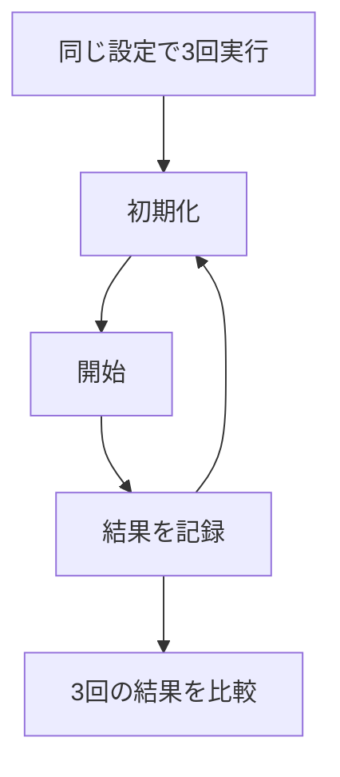

# 🎯 PSO（粒子群最適化）アルゴリズムの仕組み

> **PSO シミュレータを使った実践的学習ガイド**

---

## 📚 はじめに

このドキュメントでは，`pso_simulator.html`を使いながら，PSOアルゴリズムの仕組みを視覚的に理解していきます．

### 🔍 このガイドで学べること
- PSOの基本概念と動作原理
- パラメータが探索に与える影響
- 建築設計への応用方法
- 実践的なチューニング技術

---

## 1. 🚀 PSO シミュレータの起動

### 準備

```bash
# ブラウザで開く
open pso_simulator.html
```

### 画面構成

| エリア | 内容 | 説明 |
|--------|------|------|
| **左側** | 粒子情報テーブル | 各粒子の位置，速度，評価値を表示 |
| **中央** | 2D等高線マップ | 探索空間と粒子の動きを可視化 |
| **右側** | 3D表示・収束曲線 | 最適化の進行状況をグラフ化 |

## 2. 🧠 PSOの基本概念

### 📍 粒子（Particle）とは？

#### 視覚的表現

| マーカー | 意味 | 説明 |
|----------|------|------|
| 🔴 **赤い点** | 現在位置 | 各粒子の現在の探索位置 |
| 🟡 **黄色い円** | 全体最良解（gbest） | 群れ全体で見つけた最良の位置 |
| 🟢 **緑の点** | 個体最良解（pbest） | 各粒子が過去に見つけた最良位置 |

#### 💡 実践演習

```markdown
1. 「初期化」ボタンをクリック
2. 赤い点がランダムに配置されることを確認
3. それぞれが「粒子」＝「解の候補」
```

### 🦅 なぜ「群れ」なのか？

> **生物学的インスピレーション**
> - 鳥の群れが餌を探す様子をモデル化
> - 各個体（粒子）が情報を共有しながら最適解を探索

## 3. ⚙️ PSOの核心：速度更新式

### 📐 速度更新の3要素

<div style="background-color: #f0f0f0; padding: 20px; border-radius: 10px; margin: 20px 0;">

**新しい速度 = ①慣性 + ②個人の経験 + ③仲間の情報**

</div>

### 💻 実装コード

```javascript
// PSOの速度更新式の実装
this.velocity.x = 
    w * this.velocity.x +                              // ①慣性項
    c1 * r1 * (this.personalBest.x - this.position.x) + // ②認知的要素
    c2 * r2 * (globalBest.position.x - this.position.x); // ③社会的要素
```

### 🔍 各要素の詳細解説

#### ① 慣性項（w × 現在の速度）

| 項目 | 内容 |
|------|------|
| **役割** | 今の進行方向を維持 |
| **パラメータ** | w（慣性重み） |
| **典型値** | 0.4 〜 0.9 |

##### 🧪 シミュレータ実験

```yaml
実験1:
  設定: w = 0.9
  結果: 粒子が大きく動き回る（探索的）
  
実験2:
  設定: w = 0.4  
  結果: 粒子の動きが小さくなる（収束的）
```

#### ② 認知的要素（c1 × r1 × (pbest - 現在位置)）

| 項目 | 内容 |
|------|------|
| **役割** | 自分の過去最良位置に戻ろうとする |
| **c1** | 個人学習係数（通常1.5） |
| **r1** | ランダム値（0〜1） |

##### 🧪 観察ポイント
```markdown
1. 「個体最良解を表示」をON
2. 緑の点（pbest）に向かって粒子が引き寄せられる様子を観察
```

#### ③ 社会的要素（c2 × r2 × (gbest - 現在位置)）

| 項目 | 内容 |
|------|------|
| **役割** | 群れ全体の最良位置に向かう |
| **c2** | 社会学習係数（通常1.5） |
| **r2** | ランダム値（0〜1） |

##### 🧪 観察ポイント
```markdown
1. 黄色い円（gbest）に全粒子が引き寄せられる様子を観察
```

## 4. 🎮 実際の動作を観察

### 📋 ステップ1: 基本動作の確認


#### 観察ポイント
- ✅ 粒子が中心（最適解）に収束していく
- ✅ 収束曲線が右下がりになる

### 📋 ステップ2: パラメータの影響を確認

#### 🧪 実験A: 慣性重み（w）の影響

| 設定 | パラメータ | 観察結果 |
|------|------------|----------|
| **探索重視** | w=0.9, c1=1.5, c2=1.5 | 粒子が広く探索，収束が遅い |
| **収束重視** | w=0.4, c1=1.5, c2=1.5 | 粒子が早く収束，局所解に陥る可能性 |

#### 🧪 実験B: 学習係数のバランス

| 設定 | パラメータ | 観察結果 |
|------|------------|----------|
| **個人重視** | w=0.7, c1=2.0, c2=0.5 | 個人の経験を重視（バラバラに動く） |
| **集団重視** | w=0.7, c1=0.5, c2=2.0 | 集団の情報を重視（群れで動く） |

### 📋 ステップ3: 複雑な関数での挙動

#### 🍌 Rosenbrock関数（バナナ関数）

```yaml
関数特性:
  形状: 細長い谷状
  難易度: 中
  
観察手順:
  1. 関数選択で「Rosenbrock」を選択
  2. 粒子が谷に沿って最適解を探す様子を観察
```

#### 🏔️ Ackley関数（多峰性関数）

```yaml
関数特性:
  形状: 多数の局所最適解
  難易度: 高
  
観察手順:
  1. 関数選択で「Ackley」を選択
  2. 局所解に捕まる粒子と脱出する粒子を観察
```

## 5. 🏗️ 建築設計への応用

### 📊 次元の拡張：2D → 14D

#### シミュレータ（2次元）

| 軸 | 意味 | 例 |
|----|------|----|
| **X軸** | パラメータ1 | 建物幅 |
| **Y軸** | パラメータ2 | 床厚 |
| **Z軸** | 評価値 | コスト |

#### 実際の建築設計（14次元）

```python
# 14個の設計パラメータ
parameters = [
    "building_width",      # 建物幅
    "building_depth",      # 建物奥行き
    "floor_thickness",     # 床厚
    "column_cross_section", # 柱断面
    # ... 残り10個のパラメータ
]
```

### 🔄 評価プロセスの比較

#### シミュレータ（単純計算）

```javascript
// 単純な数式で即座に計算
evaluate: (x, y) => x*x + y*y  // ミリ秒単位
```

#### 建築設計（複雑な解析）

```python
# FEM解析を含む複雑な評価
def evaluate_building_from_params(params):
    """1つの評価に数分かかる場合も"""
    
    # Step 1: 3Dモデル生成
    model = generate_3d_model(params)
    
    # Step 2: FEM構造解析
    fem_results = run_fem_analysis(model)
    
    # Step 3: 複数指標の計算
    results = {
        'safety_factor': calculate_safety(fem_results),
        'cost': calculate_cost(model),
        'co2_emission': calculate_co2(model)
    }
    
    return results
```

## 6. 🧪 実践的な理解のための実験

### 実験1: 収束速度の比較

<table>
<tr>
<th>粒子数</th>
<th>実行手順</th>
<th>期待される結果</th>
</tr>
<tr>
<td>5粒子</td>
<td rowspan="3">
1. 粒子数を設定<br>
2. 「開始」をクリック<br>
3. 収束曲線を記録
</td>
<td>不安定，早い収束</td>
</tr>
<tr>
<td>10粒子</td>
<td>バランスが良い</td>
</tr>
<tr>
<td>20粒子</td>
<td>安定，遅い収束</td>
</tr>
</table>

### 実験2: 初期配置の影響



### 実験3: パラメータチューニング

#### 🎯 チューニング戦略

| フェーズ | 推奨設定 | 理由 |
|----------|----------|------|
| **探索初期** | w=0.9, c1=1.5, c2=1.5 | 広域探索 |
| **中期** | w=0.7, c1=1.5, c2=1.5 | バランス |
| **収束期** | w=0.4, c1=1.5, c2=1.5 | 精密化 |

## 7. ❓ よくある質問

### Q1: なぜランダム値（r1, r2）を使うの？

> **回答**: 探索の多様性を保つため
> 
> - 毎回同じ動きだと，限られた範囲しか探索できない
> - ランダム性により，局所解からの脱出が可能になる

### Q2: 粒子が範囲外に出たらどうなる？

> **回答**: 境界処理で範囲内に戻される

```javascript
// 境界処理の実装例
this.position.x = Math.max(range[0], Math.min(range[1], this.position.x));
```

### Q3: いつ探索を終了すればいい？

> **回答**: 以下の条件のいずれか

| 終了条件 | 説明 |
|----------|------|
| **反復回数** | 事前に決めた回数（例：20回） |
| **収束判定** | 改善が見られなくなったとき |
| **目標達成** | 十分良い解が見つかったとき |

## 8. 📊 まとめ：PSOの利点と欠点

### ✅ 利点

| 特徴 | 説明 |
|------|------|
| **シンプル** | 実装が簡単で理解しやすい |
| **並列性** | 各粒子が独立して計算可能 |
| **連続最適化** | 連続値パラメータの最適化に強い |
| **少ないパラメータ** | w, c1, c2 の3つのみ |

### ⚠️ 欠点

| 課題 | 対策 |
|------|------|
| **パラメータ調整** | 問題に応じた調整が必要 |
| **局所解** | 多様性を保つ工夫が必要 |
| **収束保証なし** | 終了条件の適切な設定が重要 |

## 9. 🚀 発展学習

### 📚 シミュレータでの追加実験

#### 実験プラン

| No. | 実験内容 | 学習ポイント |
|-----|----------|-------------|
| 1 | 速度制限の効果（maxVelocity） | 探索の安定性 |
| 2 | 異なる目的関数での性能比較 | 問題特性への適応 |
| 3 | 粒子の軌跡を追跡 | 探索パターンの理解 |

### 💻 実際のコードとの対応

#### シミュレータ（JavaScript - 2次元）

```javascript
class Particle {
    constructor(x, y) {
        this.position = {x: x, y: y};      // 2次元
        this.velocity = {x: 0, y: 0};      // 2次元
    }
    
    update(globalBest, w, c1, c2) {
        // 2次元での速度・位置更新
    }
}
```

#### 建築設計（Python - 14次元）

```python
class Particle:
    def __init__(self, bounds):
        # 14次元での初期化
        self.position = np.random.uniform(
            bounds[:, 0], 
            bounds[:, 1]
        )  # shape: (14,)
        
        self.velocity = np.zeros(14)  # 14次元
    
    def update(self, gbest_position, w, c1, c2):
        # 14次元での速度更新
        r1, r2 = np.random.random(2)
        
        self.velocity = (
            w * self.velocity +
            c1 * r1 * (self.pbest_position - self.position) +
            c2 * r2 * (gbest_position - self.position)
        )
```

> 💡 **重要**: 構造は同じ，次元数が違うだけ！

---

### 🎯 次のステップ

1. **PSO.py** を読んで実装を理解
2. **simple_random_batch.py** で建築最適化を実行
3. パラメータを調整して性能を改善

---

<div style="text-align: center; margin-top: 40px;">

**Happy Optimization! 🚀**

</div>