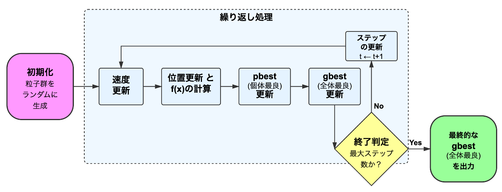
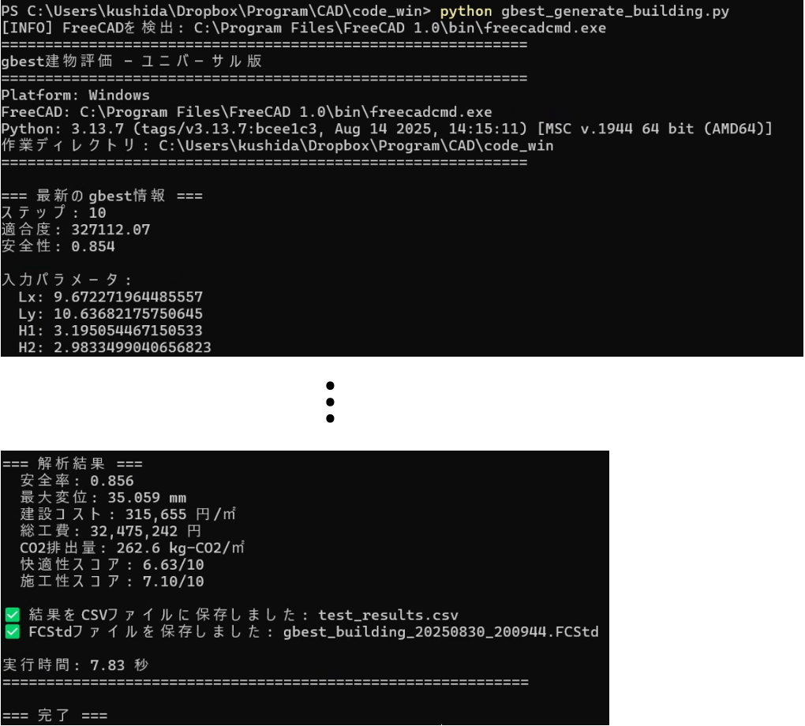

# AI-Arch: AI-based Architectural Design Optimization

**AI-Arch** is an automated building design optimization system. It combines parametric modeling (FreeCAD), finite element analysis (FEM), and particle swarm optimization (PSO) to discover optimal architectural designs based on user-defined goals.

[](docs/pso_optimization_manual.html)

---

## 📚 Documentation

**For a comprehensive understanding, please see the full documentation.**

- **[Overall Guide: learning_overview.html](https://jkushida.github.io/ai-arch/docs/learning_overview.html)**
- **[PSO Optimization Manual: pso_optimization_manual.html](https://jkushida.github.io/ai-arch/docs/pso_optimization_manual.html)**
- **[FEM Analysis Manual: generate_building_fem_analyze_report.html](https://jkushida.github.io/ai-arch/docs/generate_building_fem_analyze_report.html)**
- **[Data Analysis Manual: data_collection_analysis_manual.html](https://jkushida.github.io/ai-arch/docs/data_collection_analysis_manual.html)**

---

## 📜 Table of Contents

- [Features](#-features)
- [Example Result](#-example-result)
- [System Architecture](#-system-architecture)
- [Requirements](#-requirements)
- [Installation](#-installation)
- [Quick Start](#-quick-start)
- [Design Parameters](#-design-parameters)
- [Evaluation Metrics](#-evaluation-metrics)
- [Customization](#-customization)
- [Contributing](#-contributing)
- [License](#-license)

---

## ✨ Features

- **Parametric Building Generation**: Creates 2-story buildings with customizable dimensions and materials using FreeCAD.
- **FEM Structural Analysis**: Evaluates structural safety with the CalculiX solver.
- **Multi-Objective Optimization**: Optimizes for cost, safety, CO2 emissions, comfort, and constructability.
- **PSO Algorithm**: Intelligently searches the design space using Particle Swarm Optimization.
- **Real-time Monitoring**: Tracks optimization progress with a live web-based visualizer.

---

## 🏆 Example Result

Below is an example of a design optimized for minimal cost while satisfying safety constraints.

[](docs/pso_optimization_manual.html)

---

## 🏗️ System Architecture

```
AI-Arch/
├── code/                    # Source code
│   ├── generate_building_fem_analyze.py  # Core analysis engine
│   ├── pso_algorithm.py    # PSO optimization implementation
│   └── ...
├── docs/                    # Documentation website (GitHub Pages)
│   ├── learning_overview.html # Main documentation page
│   └── imgs/               # Image assets
├── pdf/                     # Reference PDF Documents
└── files/                   # Output files (simulators, data)
```

---

## 🔧 Requirements

- **FreeCAD** (v0.21 or later)
- **CalculiX** (FEM solver, typically included with FreeCAD)
- **Python 3.8+**
- **Dependencies**: `numpy`, `pandas`, `matplotlib`, `flask`

---

## 🚀 Installation

1.  **Install FreeCAD**:
    -   **Mac**: `brew install --cask freecad`
    -   **Windows**: Download from the [FreeCAD website](https://www.freecad.org/)
    -   **Linux**: `sudo apt-get install freecad`

2.  **Clone the repository**:
    ```bash
    git clone https://github.com/jkushida/ai-arch.git
    cd ai-arch
    ```

3.  **Install Python dependencies**:
    ```bash
    pip install numpy pandas matplotlib flask
    ```

---

## ▶️ Quick Start

### 1. Test a Single Building Design

Execute the test script using the FreeCAD command-line tool.

-   **Mac**:
    ```bash
    /Applications/FreeCAD.app/Contents/Resources/bin/freecadcmd code/test_generate_building.py
    ```
-   **Windows**:
    ```bash
    "C:\Program Files\FreeCAD\bin\freecadcmd.exe" code/test_generate_building.py
    ```

### 2. Run PSO Optimization

-   **Start the optimization algorithm**:
    ```bash
    /Applications/FreeCAD.app/Contents/Resources/bin/freecadcmd code/pso_algorithm.py
    ```
-   **In a separate terminal, start the monitor**:
    ```bash
    python3 code/monitor_pso_mac.py
    ```

### 3. View Results

-   **Live Monitor**: `http://localhost:5001`
-   **Data**: `pso_output/csv/`
-   **3D Models**: `.FCStd` files generated during the process.

---

## 📐 Design Parameters

The system optimizes 21 design variables, including:

-   **Shape Parameters (15)**: Building dimensions (Lx, Ly, H1, H2), structural sizes (beams, columns), and architectural features (wall angles, window ratios, roof shape).
-   **Material Parameters (6)**: Materials for columns, floors, roof, etc. (0 for concrete, 1 for wood).

---

## 📊 Evaluation Metrics

Each design is evaluated against 5 key metrics:

1.  **Safety**: Structural safety factor (must be ≥ 2.0).
2.  **Cost**: Construction cost (¥/m²).
3.  **CO2**: Environmental impact (kg-CO2/m²).
4.  **Comfort**: Spatial quality score (0-10).
5.  **Constructability**: Construction difficulty score (0-10).

---

## ⚙️ Customization

### Modify Optimization Objective

Edit `code/pso_config.py` to change the fitness function. For example, to minimize CO2 instead of cost:

```python
def calculate_fitness(cost, safety, co2, comfort, constructability):
    # Objective: Minimize CO2
    fitness = co2
    
    # Penalty for violating the safety constraint
    if safety < 2.0:
        fitness += (2.0 - safety) * 100000
    
    return fitness
```

### Adjust PSO Parameters

Tune the PSO algorithm by editing `code/pso_config.py`:

```python
N_PARTICLES = 15  # Number of particles
MAX_ITER = 20     # Number of iterations
W = 0.7           # Inertia weight
C1 = 1.5          # Cognitive coefficient
C2 = 1.5          # Social coefficient
```

---

## 🤝 Contributing

Contributions are welcome! Please fork the repository, create a feature branch, and submit a pull request.

## 📄 License

This project is licensed under the MIT License. See the `LICENSE` file for details.
