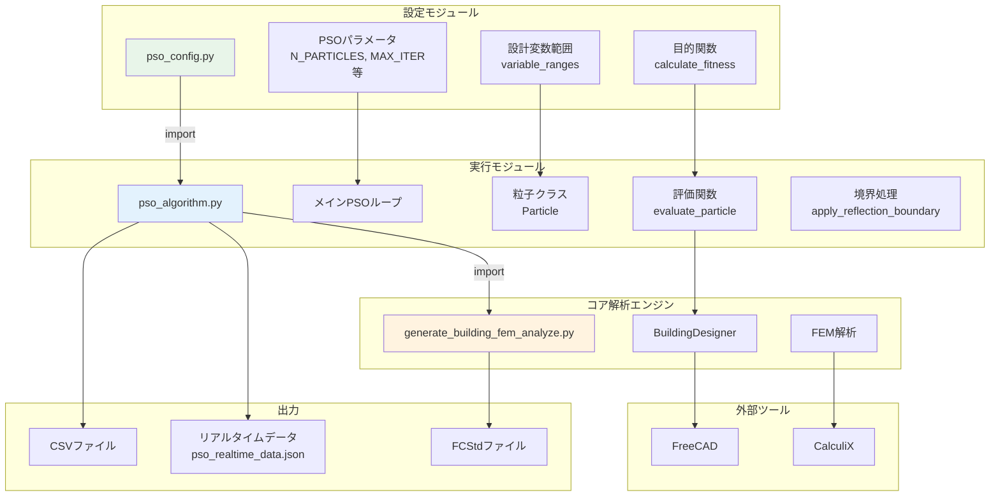
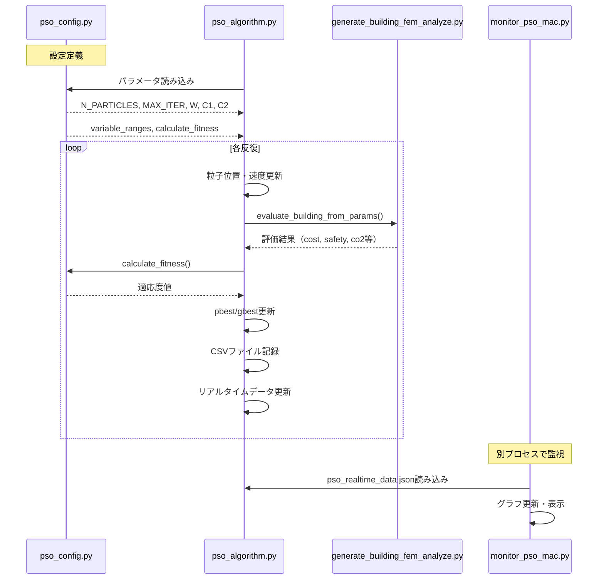

# PSO（粒子群最適化）使用ガイド

## 概要
PSO（Particle Swarm Optimization）は，粒子群最適化アルゴリズムを用いて建築設計の最適化を行うシステムです．`pso_config.py`で設定を管理し，`pso_algorithm.py`で実際の最適化を実行する2ファイル構成になっています．

## システム構成

### モジュール構成図


```mermaid
graph TB
    subgraph "設定モジュール"
        A[pso_config.py]
        A1[PSOパラメータ<br/>N_PARTICLES, MAX_ITER等]
        A2[設計変数範囲<br/>variable_ranges]
        A3[目的関数<br/>calculate_fitness]
    end
    
    subgraph "実行モジュール"
        B[pso_algorithm.py]
        B1[メインPSOループ]
        B2[粒子クラス<br/>Particle]
        B3[評価関数<br/>evaluate_particle]
        B4[境界処理<br/>apply_reflection_boundary]
    end
    
    subgraph "コア解析エンジン"
        C[generate_building_fem_analyze.py]
        C1[BuildingDesigner]
        C2[FEM解析]
    end
    
    subgraph "外部ツール"
        D[FreeCAD]
        E[CalculiX]
    end
    
    subgraph "出力"
        F[CSVファイル]
        G[リアルタイムデータ<br/>pso_realtime_data.json]
        H[FCStdファイル]
    end
    
    A --> |import| B
    A1 --> B1
    A2 --> B2
    A3 --> B3
    
    B --> |import| C
    B3 --> C1
    C1 --> D
    C2 --> E
    
    B --> F
    B --> G
    C --> H
    
    style A fill:#e8f5e9
    style B fill:#e3f2fd
    style C fill:#fff3e0
```

### データフロー


```mermaid
sequenceDiagram
    participant Config as pso_config.py
    participant PSO as pso_algorithm.py
    participant Core as generate_building_fem_analyze.py
    participant Monitor as monitor_pso_mac.py
    
    Note over Config: 設定定義
    PSO->>Config: パラメータ読み込み
    Config-->>PSO: N_PARTICLES, MAX_ITER, W, C1, C2
    Config-->>PSO: variable_ranges, calculate_fitness
    
    loop 各反復
        PSO->>PSO: 粒子位置・速度更新
        PSO->>Core: evaluate_building_from_params()
        Core-->>PSO: 評価結果（cost, safety, co2等）
        PSO->>Config: calculate_fitness()
        Config-->>PSO: 適応度値
        PSO->>PSO: pbest/gbest更新
        PSO->>PSO: CSVファイル記録
        PSO->>PSO: リアルタイムデータ更新
    end
    
    Note over Monitor: 別プロセスで監視
    Monitor->>PSO: pso_realtime_data.json読み込み
    Monitor->>Monitor: グラフ更新・表示
```

## ファイル構成と役割

### 1. `pso_config.py`（設定ファイル）

**役割**: すべての設定パラメータを集約管理

#### PSOパラメータ設定
```python
N_PARTICLES = 15  # 粒子数
MAX_ITER = 20     # 反復回数  
W = 0.7           # 慣性重み
C1 = 1.5          # 個人的最良解への加速係数
C2 = 1.5          # 群最良解への加速係数
V_MAX = 0.2       # 最大速度（探索範囲の割合）
```

#### 設計変数の範囲定義
```python
variable_ranges = {
    "Lx": (8, 12),           # 建物幅 [m]
    "Ly": (6, 12),           # 建物奥行 [m]
    "H1": (2.6, 3.5),        # 1階高さ [m]
    "H2": (2.6, 3.2),        # 2階高さ [m]
    # ... 全21個の設計変数
}
```

#### 目的関数の定義
```python
def calculate_fitness(cost, safety, co2, comfort, constructability):
    # 基本適応度：コストのみ
    fitness = cost
    
    # 安全率ペナルティ
    SAFETY_THRESHOLD = 2.0
    if safety < SAFETY_THRESHOLD:
        fitness += (SAFETY_THRESHOLD - safety) * 100000
    
    return fitness
```

### 2. `pso_algorithm.py`（実行ファイル）

**役割**: PSO最適化アルゴリズムの実装と実行

#### 主要機能
- プロセスクリーンアップ
- 粒子の初期化と評価
- PSOメインループ
- 境界処理（鏡像反射）
- 結果の記録とリアルタイムデータ更新

#### インポート関係
```python
from pso_config import (
    N_PARTICLES,
    MAX_ITER,
    W, C1, C2, V_MAX,
    variable_ranges,
    calculate_fitness
)

from generate_building_fem_analyze import evaluate_building_from_params
```

## 実行方法

### 基本的な実行
```bash
# Mac
/Applications/FreeCAD.app/Contents/Resources/bin/freecadcmd pso_algorithm.py

# Windows  
"C:\Program Files\FreeCAD 1.0\bin\freecadcmd.exe" pso_algorithm.py
```

### リアルタイム監視（別ターミナル）
```bash
# Mac版モニタ
python3 monitor_pso_mac.py

# Windows版モニタ
python monitor_pso_win.py
```

## 設定のカスタマイズ方法

### 1. PSOパラメータの調整

`pso_config.py`を編集：

```python
# より詳細な探索（時間がかかる）
N_PARTICLES = 30  # 粒子数を増やす
MAX_ITER = 50     # 反復回数を増やす

# より速い収束（精度は低下）
N_PARTICLES = 10  # 粒子数を減らす
MAX_ITER = 10     # 反復回数を減らす
```

### 2. 設計変数範囲の変更

`pso_config.py`の`variable_ranges`を編集：

```python
variable_ranges = {
    "Lx": (10, 15),      # 建物幅の範囲を変更
    "tf": (500, 500),    # 床スラブ厚を固定（上限=下限）
    # ...
}
```

### 3. 目的関数の変更

`pso_config.py`の`calculate_fitness`関数を編集：

#### 例1: CO2最小化
```python
def calculate_fitness(cost, safety, co2, comfort, constructability):
    # CO2排出量を最小化
    fitness = co2
    
    # 安全率制約は維持
    SAFETY_THRESHOLD = 2.0
    if safety < SAFETY_THRESHOLD:
        fitness += (SAFETY_THRESHOLD - safety) * 100000
    
    return fitness
```

#### 例2: 多目的最適化
```python
def calculate_fitness(cost, safety, co2, comfort, constructability):
    # 重み付け和による多目的最適化
    w_cost = 0.4
    w_co2 = 0.3
    w_comfort = 0.3
    
    # 正規化（仮の最大値で除算）
    norm_cost = cost / 500000
    norm_co2 = co2 / 2000
    norm_comfort = 1 - (comfort / 10)  # 快適性は最大化なので反転
    
    fitness = w_cost * norm_cost + w_co2 * norm_co2 + w_comfort * norm_comfort
    
    # 安全率制約
    SAFETY_THRESHOLD = 2.0
    if safety < SAFETY_THRESHOLD:
        fitness += (SAFETY_THRESHOLD - safety) * 100
    
    return fitness
```

#### 例3: 快適性最大化
```python
def calculate_fitness(cost, safety, co2, comfort, constructability):
    # 快適性を最大化（負の値にする）
    fitness = -comfort
    
    # 安全率制約
    SAFETY_THRESHOLD = 2.0
    if safety < SAFETY_THRESHOLD:
        fitness += (SAFETY_THRESHOLD - safety) * 100
    
    return fitness
```

### 4. 変数の固定方法

特定の設計変数を固定したい場合，`variable_ranges`で上限と下限を同じ値に設定：

```python
variable_ranges = {
    # 材料を固定
    "material_columns": (0.0, 0.0),    # コンクリート固定
    "material_walls": (1.0, 1.0),      # 木材固定
    
    # 寸法を固定
    "tf": (500, 500),                  # 床スラブ厚500mm固定
    
    # 範囲で最適化
    "Lx": (8, 12),                     # 建物幅は8-12mで最適化
    # ...
}
```

## 出力ファイル

### ディレクトリ構造
```
pso_output/
├── csv/
│   ├── pso_particle_positions.csv  # 全粒子の位置履歴
│   ├── pso_pbest_positions.csv     # 個人最良位置履歴
│   ├── pso_gbest_history.csv       # 全体最良解の推移
│   └── pso_settings.csv            # 実行時の設定
├── images/                         # monitor_psoで生成
│   ├── pso_convergence.png         # 収束曲線
│   └── pso_all_positions_*.png     # 散布図
├── pso_realtime_data.json          # リアルタイムデータ
└── pso_completed.flag              # 完了フラグ
```

### CSVファイルの内容

#### pso_particle_positions.csv
- 各反復での全粒子の現在位置
- 評価値（fitness, cost, safety, co2, comfort, constructability）
- 全21個の設計変数値

#### pso_gbest_history.csv  
- 各反復での最良解の推移
- 最良解の評価値と設計変数

#### pso_settings.csv
- PSOパラメータ（粒子数，反復回数等）
- 設計変数の範囲
- 実行開始時刻

## トラブルシューティング

### よくあるエラーと対処法

#### 1. ImportError
```
❌ インポートエラー: No module named 'generate_building_fem_analyze'
```
**対処法**: 
- `generate_building_fem_analyze.py`が同じディレクトリにあることを確認
- ファイル名のスペルミスがないか確認

#### 2. タイムアウト頻発
```
❌ 粒子 X の評価失敗: evaluation timeout
```
**対処法**:
- 設計変数の範囲を狭める
- 粒子数を減らす
- メッシュ設定を簡略化

#### 3. メモリ不足
```
MemoryError
```
**対処法**:
- 粒子数（N_PARTICLES）を減らす
- 反復回数（MAX_ITER）を減らす
- 評価後のクリーンアップが正常に動作しているか確認

### プロセスのクリーンアップ

停止したプロセスが残っている場合：

```bash
# 停止プロセスの確認
ps aux | grep PSO.py

# プロセスの強制終了
kill -9 [PID]

# CalculiXプロセスも確認
ps aux | grep ccx
```

## 実行例

### コンソール出力
```
🚀 粒子群最適化アルゴリズムによる建築設計最適化開始
📊 粒子数: 15, 反復回数: 20
🔧 PSO パラメータ: W=0.7, C1=1.5, C2=1.5

📝 リアルタイムデータ: pso_output/pso_realtime_data.json
💡 別ターミナルで monitor_pso.py を実行するとリアルタイム監視できます

✅ 評価関数のインポート成功

設計変数の範囲
変数名    最小値    最大値    単位
Lx        8         12        m
Ly        6         12        m
...

📊 初期粒子群の生成と評価...

🧬 粒子 1/15
  粒子 1: cost=425565, safety=0.55, CO2=1318, comfort=5.5

[最適化プロセス]

🏁 最適化完了！
============================================================

🏆 最終的な最良解:
  fitness = 380000.00
  cost = 380000 円/m²
  safety = 2.15
  CO2 = 1200 kg-CO2/m²
  comfort = 6.8
  constructability = 7.5

設計変数:
  Lx = 10.5
  Ly = 9.8
  ...
```

## 関連ドキュメント

- `test_generate_building_usage.md` - 単体テストの使用方法
- `generate_building_fem_analyze_report.md` - コア解析エンジンの詳細
- `fem_optimization_comparison.md` - 最適化手法の比較