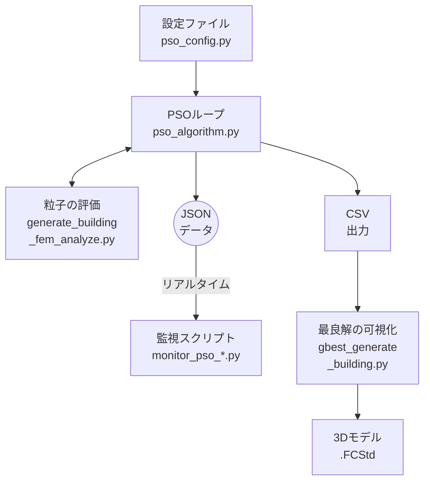

# PSO（粒子群最適化）使用ガイド

## 概要
PSO（Particle Swarm Optimization）は、生物の群れの行動を模倣した最適化アルゴリズムです。本システムでは、このPSOを用いて建築設計の多次元な設計空間から最適な解を探索します。

主な特徴は以下の通りです。

- **設定とロジックの分離**: `pso_config.py`でパラメータや目的関数を容易に変更でき、`pso_algorithm.py`のコアロジックに触れる必要がありません。
- **リアルタイム監視**: 最適化の進行状況を別プロセスでリアルタイムに可視化できます。
- **柔軟な目的関数**: コスト、CO2、安全性、快適性などを組み合わせた独自の評価基準を設定できます。

---

## システム構成

### システム構成図



- **設定ファイル** - `pso_config.py`（パラメータと目的関数の定義）
- **PSOループ** - `pso_algorithm.py`（最適化アルゴリズムの実行）
- **粒子の評価** - `generate_building_fem_analyze.py`（建物生成とFEM解析）
- **JSONデータ** - `pso_realtime_data.json`（リアルタイムデータ）
- **監視スクリプト** - `monitor_pso_mac.py` / `monitor_pso_win.py`（進捗可視化）
- **CSV出力** - `pso_gbest_history.csv`（最良解の履歴）
- **最良解の可視化** - `gbest_generate_building.py`（現時点のgbestから3Dモデル生成）
- **3Dモデル** - `.FCStd`ファイル（FreeCADで開ける構造モデル）

### プロセスの流れ
1.  **設定の読み込み**: `pso_algorithm.py`が起動すると、まず`pso_config.py`から粒子数、反復回数、設計変数の範囲、目的関数などのすべての設定を読み込みます。
2.  **PSOループの開始**: 設定に基づき、PSOのメインループが開始されます。
3.  **粒子の評価**: ループ内で、各粒子（設計案）が持つパラメータを`generate_building_fem_analyze.py`に渡し、構造解析（FEM）などを通じて性能（コスト、安全性など）を評価します。
4.  **評価値のフィードバック**: 評価結果はPSOループに返され、各粒子は自身の過去最良解（pbest）と群全体の最良解（gbest）を更新します。
5.  **データ出力**: 各反復の最後に、全粒子の状態や最良解の情報を`pso_realtime_data.json`とCSVファイル（`pso_gbest_history.csv`）に出力します。
6.  **リアルタイム監視**: `monitor_pso_*.py`は、`pso_realtime_data.json`を定期的に監視し、最適化の収束状況や設計変数の分布をグラフで表示します。これは最適化プロセスとは独立して動作します。
7.  **最良解の可視化**: 任意のタイミングで`gbest_generate_building.py`を実行すると、現時点での最良解（gbest）から建物の3Dモデル（.FCStd）を生成し、構造を詳細に確認できます。

---

## ファイル構成と役割

### 1. `pso_config.py`（設定ファイル）
**役割**: PSOの挙動を制御するすべてのパラメータと評価基準を定義します。ユーザーが主に編集するファイルです。

#### PSOパラメータ設定
PSOアルゴリズムの探索挙動を決定します。
```python
N_PARTICLES = 15  # 粒子数: 多いほど広範囲を探索できるが計算時間が増加
MAX_ITER = 20     # 最大反復回数: 大きいほど解が収束する可能性が高い
W = 0.7           # 慣性重み: 粒子の現在の移動速度をどれだけ維持するか
C1 = 1.5          # 個人的最良解への加速係数: 粒子が自身の最良解に向かう強さ
C2 = 1.5          # 群最良解への加速係数: 粒子が群全体の最良解に向かう強さ
V_MAX = 0.2       # 最大速度: 粒子が一度に移動できる最大距離（探索範囲に対する割合）
```

#### 設計変数の範囲定義
最適化対象となる建物の設計変数が取りうる値の範囲を定義します。
```python
variable_ranges = {
    "Lx": (8, 12),      # 建物幅は8mから12mの間で最適化
    # ... 全20個の設計変数
}
```
このタプル `(下限値, 上限値)` を変更することで、各変数の探索範囲を自由に調整できます。

#### 目的関数の定義
**このシステムの心臓部です。** 何を「良い設計」とするかを定義します。`generate_building_fem_analyze`から受け取った複数の性能指標を組み合わせ、単一の「適応度（fitness）」を計算します。PSOはこの適応度が最小（または最大）になる解を探します。
```python
def calculate_fitness(cost, safety, co2, comfort, constructability):
    # 適応度（fitness）が小さいほど良い評価となるように設計する
    fitness = cost  # 例: まずはコストを基準にする
    
    # 安全率が閾値を下回る場合に大きなペナルティを与え、不良設計を回避する
    SAFETY_THRESHOLD = 2.0
    if safety < SAFETY_THRESHOLD:
        fitness += (SAFETY_THRESHOLD - safety) * 100000
    
    return fitness
```

### 2. `pso_algorithm.py`（実行ファイル）
**役割**: PSOのアルゴリズムを実装し、最適化プロセス全体を管理します。通常、このファイルを編集する必要はありません。

#### 主要機能
- **プロセスクリーンアップ**: 過去の実行で残った可能性のあるプロセスをクリーンアップします。
- **粒子の初期化**: 設計変数範囲内で粒子群をランダムに初期配置します。
- **PSOメインループ**: `MAX_ITER`で指定された回数、以下の処理を繰り返します。
    1.  全粒子の評価
    2.  `pbest`（個人最良解）と`gbest`（全体最良解）の更新
    3.  各粒子の速度と位置の更新
- **境界処理**: 粒子の位置が設計変数範囲外に出た場合に、範囲内に引き戻します（鏡像反射法）。
- **結果の記録**: ログ、CSV、リアルタイムデータをファイルに出力します。

---

## 実行方法

### 1. 最適化の開始
`pso_algorithm.py`をFreeCADのPython環境で実行します。
```bash
# Macの場合
/Applications/FreeCAD.app/Contents/Resources/bin/freecadcmd pso_algorithm.py

# Windowsの場合
"C:\Program Files\FreeCAD 1.0\bin\freecadcmd.exe" pso_algorithm.py
```

### 2. リアルタイム監視（別ターミナルで実行）
最適化プロセスとは別のターミナルを開き、監視スクリプトを実行します。
```bash
# Macの場合
python3 monitor_pso_mac.py

# Windowsの場合
python monitor_pso_win.py
```

---

## 設定のカスタマイズ方法
`pso_config.py`を編集することで、様々な条件下で最適化を実行できます。

### 1. 目的関数の変更
`calculate_fitness`関数を書き換えることで、最適化の目標を変更できます。

#### 例1: CO2排出量を主目的とする
```python
def calculate_fitness(cost, safety, co2, comfort, constructability):
    fitness = co2  # CO2排出量を最小化
    
    # 安全率の制約は必須
    SAFETY_THRESHOLD = 2.0
    if safety < SAFETY_THRESHOLD:
        fitness += (SAFETY_THRESHOLD - safety) * 100000
    
    return fitness
```

#### 例2: 重み付け和による多目的最適化
コスト、CO2、快適性をバランス良く考慮します。各指標のスケールが異なるため、正規化（0-1の範囲に揃える）が重要です。
```python
def calculate_fitness(cost, safety, co2, comfort, constructability):
    # 各目的の重み
    w_cost = 0.4
    w_co2 = 0.3
    w_comfort = 0.3
    
    # 各指標を正規化（仮の最大値で除算）
    norm_cost = cost / 500000
    norm_co2 = co2 / 2000
    norm_comfort = 1 - (comfort / 10)  # 快適性は最大化が目的なので1から引く
    
    fitness = w_cost * norm_cost + w_co2 * norm_co2 + w_comfort * norm_comfort
    
    # 安全率ペナルティ
    SAFETY_THRESHOLD = 2.0
    if safety < SAFETY_THRESHOLD:
        fitness += (SAFETY_THRESHOLD - safety) * 100
    
    return fitness
```

### 2. 変数の固定
特定の設計変数を固定値にしたい場合、`variable_ranges`で範囲の最小値と最大値を同じ値に設定します。
```python
variable_ranges = {
    # 床スラブ厚を500mmに固定
    "tf": (500, 500),
    
    # 建物幅は8mから12mで最適化
    "Lx": (8, 12),
    # ...
}
```

---

## 出力ファイル
最適化の結果は`pso_output/`ディレクトリに保存されます。

### ディレクトリ構造
```
pso_output/
├── csv/
│   ├── pso_particle_positions.csv  # 全粒子の全反復における位置と評価値
│   ├── pso_pbest_positions.csv     # 各粒子の個人最良解の履歴
│   ├── pso_gbest_history.csv       # 全体最良解の進化の記録
│   └── pso_settings.csv            # 実行時の設定パラメータ
├── images/                         # 監視スクリプトが生成するグラフ画像
│   ├── pso_convergence.png         # 収束曲線
│   └── pso_all_positions_*.png     # 各反復での粒子分布図
├── pso_realtime_data.json          # 監視スクリプトが参照するリアルタイムデータ
└── pso_completed.flag              # 完了時に生成されるフラグファイル
```

### 主要なCSVファイル

| ファイル名 | 内容 | 用途 |
|---|---|---|
| **pso_gbest_history.csv** | 各反復での全体最良解（gbest）の履歴 | 最適化の収束過程を確認、`gbest_generate_building.py`の入力 |
| **pso_particle_positions.csv** | 全粒子の全反復における位置と評価値 | 探索空間の網羅性分析、粒子の動きの可視化 |
| **pso_pbest_positions.csv** | 各粒子の個人最良解（pbest）の履歴 | 各粒子の改善過程の追跡 |
| **pso_settings.csv** | PSO実行時のパラメータ設定 | 実行条件の記録、再現性の確保 |

これらのCSVファイルは`pso_output/csv/`ディレクトリに自動的に保存され、最適化プロセスの詳細な分析に使用できます。

---

## 最良解の3Dモデル生成

### gbest_generate_building.pyの使い方

PSO最適化で見つかった最良解（gbest）の建物を3Dモデル化し、詳細に評価するためのツールです。

#### 必要なファイル構造
```
pso_output/
└── csv/                            # CSVファイル格納ディレクトリ
    ├── pso_particle_positions.csv # 全粒子の位置履歴
    ├── pso_pbest_positions.csv    # 各粒子の最良解履歴
    ├── pso_gbest_history.csv      # ← このファイルを読み込み
    └── pso_settings.csv           # PSO実行時の設定
```

`gbest_generate_building.py`は`pso_output/csv/pso_gbest_history.csv`から最新のgbest情報を自動的に読み込みます。

#### 機能
- `pso_gbest_history.csv`の最終行（最良解）を自動読み込み
- 最適化された建物の3Dモデル（.FCStd）を生成
- FEM解析を実行して詳細な評価結果を取得
- `test_results.csv`と同じ形式で結果を出力

#### 実行方法

```bash
# Mac
/Applications/FreeCAD.app/Contents/Resources/bin/freecadcmd code/gbest_generate_building.py

# Windows
"C:\Program Files\FreeCAD 1.0\bin\freecadcmd.exe" code\gbest_generate_building.py
```

#### 出力ファイル
- **gbest_building_[timestamp].FCStd**: 最適化された建物の3Dモデル
- **test_results.csv**: 評価結果（test_generate_building.pyと同じ形式）

#### 実行例

```
=== 最新のgbest情報 ===
iteration: 20
Lx: 9.234
Ly: 7.891
H1: 3.156
H2: 2.987
...
fitness: 145678.5
cost: 265000
safety: 2.45
co2: 423.5
comfort: 7.8
constructability: 8.2

=== 建物評価テスト実行開始 ===

解析実行中...

=== 解析結果 ===

【安全性】
  安全率: 2.450
  最大変位: 8.234 mm
  最大応力: 3.567 MPa

【経済性】
  建設コスト: 265,000 円/㎡
  総工費: 19,320,000 円

【環境性】
  CO2排出量: 423.5 kg-CO2/㎡

【快適性】
  快適性スコア: 7.80/10

【施工性】
  施工性スコア: 8.20/10

✅ 結果をCSVファイルに保存しました: test_results.csv
✅ 3Dモデルを保存しました: gbest_building_20250807_143052.FCStd
```

#### 活用シーン
1. **最終確認**: PSO最適化完了後、最良解の詳細確認
2. **可視化**: 最適化された建物の3D形状を確認
3. **レポート作成**: 最適化結果の文書化用データ取得
4. **比較分析**: 手動設計との性能比較

---

## トラブルシューティング

### 1. `ImportError`

**エラー**: `No module named 'generate_building_fem_analyze'`

**原因**: Pythonが`generate_building_fem_analyze.py`を見つけられない。

**対処法**: `pso_algorithm.py`と同じディレクトリに`generate_building_fem_analyze.py`が存在することを確認してください。

### 2. 評価のタイムアウトが頻発する

**ログ**: `粒子 X の評価失敗: evaluation timeout`

**原因**: FEM解析に時間がかかりすぎている。複雑な形状や細かいメッシュが原因の可能性があります。

**対処法**:
- `pso_config.py`で設計変数の範囲を狭め、極端な形状が生成されないようにする。
- `generate_building_fem_analyze.py`内のメッシュ設定を粗くする。
- `pso_algorithm.py`のタイムアウト設定値を長くする。

### 3. プロセスが残存してしまう

**現象**: 途中で停止した後、再実行時に問題が発生する。

**原因**: FreeCADやCalculiXのプロセスが終了せずに残っている。

**対処法**:
```bash
# "PSO.py"や"ccx"を含むプロセスを探す
ps aux | grep -E "PSO.py|ccx"

# 見つかったプロセスのID（PID）を指定して強制終了
kill -9 [PID]
```
