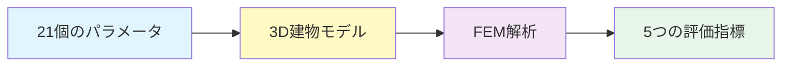
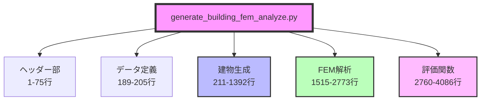
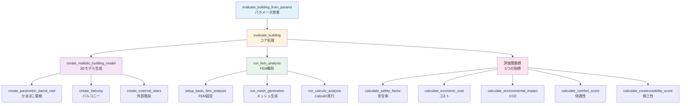
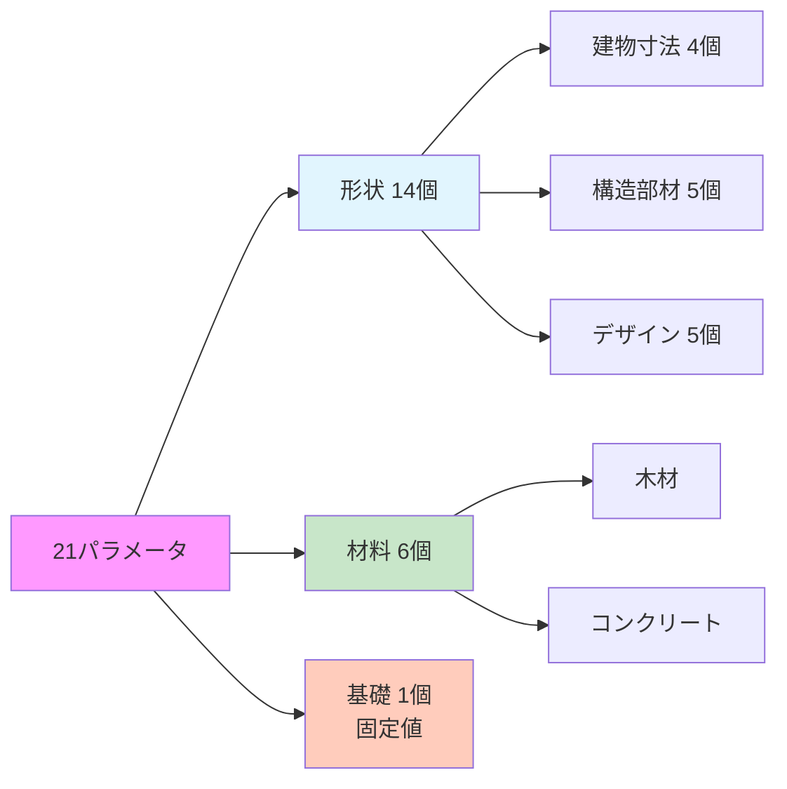
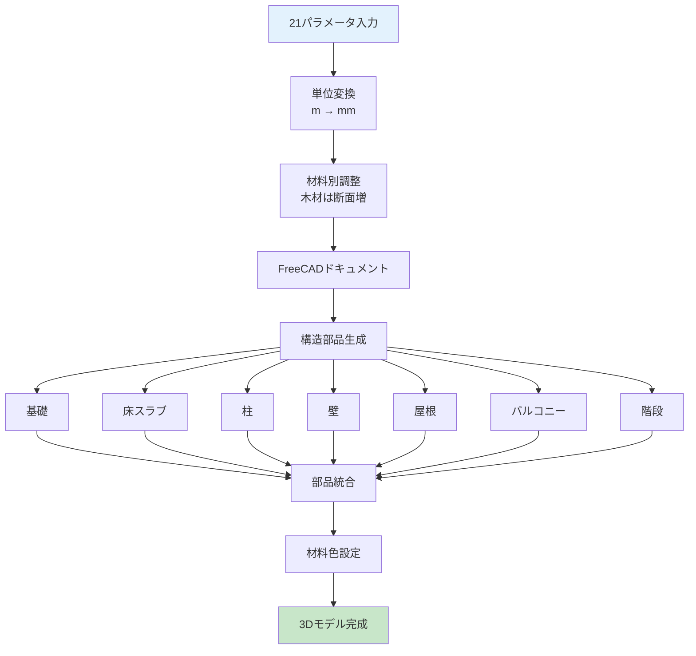

# `generate_building_fem_analyze.py` 詳細レポート

## 📋 目次

### 🔍 クイックナビゲーション

| セクション | 内容 | ページ |
|:---:|---|:---:|
| 🎯 [概要](#概要) | モジュールの目的と機能の概要 | 1 |
| 📁 [ファイル構造](#ファイル構造) | スクリプトの主要な構成要素と行範囲 | 2 |
| 🏛️ [建物生成プロセス](#パラメータから建物を作るプロセス) | 21個のパラメータから3Dモデルへ | 3 |
| 📊 [評価プロセス](#評価プロセス) | FEM解析と5つの評価指標 | 4 |
| 💻 [使用方法](#使用方法) | 実装例とパラメータ範囲 | 5 |
| ✨ [主要な特徴](#主要な特徴) | パラメトリック設計と多目的評価 | 6 |
| ⚠️ [注意事項](#使用上の注意) | 環境要件とパフォーマンス | 7 |
| 🔧 [トラブルシューティング](#トラブルシューティング) | よくある問題と解決策 | 8 |
| 🌳 [材料選択](#材料選択機能詳細) | コンクリートvs木材 | 9 |
| 🧪 [テスト](#テストと検証) | 検証方法と出力データ | 10 |

## 🎯 概要

`generate_building_fem_analyze.py`は，FreeCADを使用して建築構造の自動生成とFEM（有限要素法）解析を行う中核モジュールです．

### 🎆 主要機能



### 🏗️ 評価指標

| 指標 | 内容 | 目標 |
|:---:|---|:---:|
| 🔒 **安全性** | 構造安全率（応力/変形） | <span style="color: #4CAF50; font-weight: bold;">⬆️ 最大化</span> |
| 💰 **経済性** | 建設コスト [円/m²] | <span style="color: #FF5722; font-weight: bold;">⬇️ 最小化</span> |
| 🌱 **環境性** | CO2排出量 [kg-CO2/m²] | <span style="color: #FF5722; font-weight: bold;">⬇️ 最小化</span> |
| 🏠 **快適性** | 居住快適性スコア [0-10] | <span style="color: #4CAF50; font-weight: bold;">⬆️ 最大化</span> |
| 🔨 **施工性** | 施工難易度スコア [0-10] | <span style="color: #4CAF50; font-weight: bold;">⬆️ 最大化</span> |

## 📁 ファイル構造

### 🗺️ コードマップ (4200行以上)



### 📊 主要セクション詳細

| 🎨 セクション | 📐 行範囲 | 📦 内容 | 📝 主要関数 |
|:---|:---:|---|---|
| **📝 ヘッダー部** | 1-75 | • エンコーディング宣言<br/>• モジュールインポート<br/>• グローバル設定 | `VERBOSE_OUTPUT`<br/>`FEM_AVAILABLE` |
| **📊 データクラス** | 189-205 | 建物パラメータの格納 | `BuildingParameters` |
| **🏠 屋根関連** | 211-491 | かまぼこ屋根の生成 | `calculate_roof_curvature()`<br/>`create_parametric_barrel_roof()` |
| **🏞️ バルコニー** | 493-543 | バルコニーと手すり | `create_balcony()` |
| **🏛️ メイン建物** | 545-1392 | 建物全体の統合生成 | `create_realistic_building_model()` |
| **🔬 FEM解析** | 1515-2773 | 構造解析の実行 | `run_fem_analysis()` |
| **📋 評価関数** | 2760-4086 | 5つの評価指標計算 | `calculate_safety_factor()`<br/>`calculate_economic_cost()`<br/>`calculate_environmental_impact()`<br/>`calculate_comfort_score()`<br/>`calculate_constructability_score()` |
| **🎯 統合関数** | 4086-4200 | パラメータから評価まで | `evaluate_building_from_params()` |

## 🔗 関数コール構造

### 🎯 メイン処理フロー



### 2. ユーティリティ関数

| 関数名 | 行番号 | 概要 |
|---|---|---|
| `get_material_name()` | 134 | 材料番号から名前への変換（0:コンクリート，1:木材） |
| `is_gui_mode()` | 1383 | GUI環境の判定（FreeCADGui利用可能かチェック） |
| `safe_remove_object()` | 1402 | 安全なオブジェクト削除（エラー抑制付き） |
| `safe_set_visibility()` | 1425 | 安全な可視性設定（GUI環境でのみ動作） |
| `safe_gui_operations()` | 1459 | GUI操作の安全実行（エラーハンドリング付き） |
| `setup_deterministic_fem()` | 1490 | 決定論的FEM設定（メッシュ生成の再現性確保） |
| `clean_document_for_fcstd_save()` | 3960 | FCStd保存前のクリーンアップ（不要オブジェクト削除） |

## 🏛️ パラメータから建物を作るプロセス

### 🌟 21個の設計パラメータ



### 📊 パラメータ詳細

#### 🏗️ 形状パラメータ（14個）

##### 📏 建物寸法
| 変数 | パラメータ名 | 単位 | 範囲 | 推奨値 | 説明 |
|:---:|:---|:---:|:---:|:---:|---|
| $x_1$ | `Lx` | m | 5.0-20.0 | 8.0-10.0 | 建物幅（東西方向） |
| $x_2$ | `Ly` | m | 4.0-15.0 | 6.0-8.0 | 建物奥行き（南北方向） |
| $x_3$ | `H1` | m | 2.5-5.0 | 3.0-3.5 | 1階高 |
| $x_4$ | `H2` | m | 2.5-4.0 | 2.8-3.0 | 2階高 |

##### 🏛️ 構造部材
| 変数 | パラメータ名 | 単位 | 範囲 | 推奨値 | 説明 |
|:---:|:---|:---:|:---:|:---:|---|
| $x_5$ | `tf` | mm | 150-400 | 200-250 | 床スラブ厚 |
| $x_6$ | `tr` | mm | 100-300 | 150-200 | 屋根スラブ厚 |
| $x_7$ | `bc` | mm | 200-600 | 300-400 | 柱幅（正方形断面） |
| $x_8$ | `hc` | mm | 200-600 | 300-400 | 柱厚 |
| $x_9$ | `tw_ext` | mm | 150-300 | 180-220 | 外壁厚 |

##### 🎨 デザイン要素
| 変数 | パラメータ名 | 単位 | 範囲 | 推奨値 | 説明 |
|:---:|:---|:---:|:---:|:---:|---|
| $x_{10}$ | `wall_tilt_angle` | 度 | -40.0～30.0 | -10.0～10.0 | 壁傾斜角度 |
| $x_{11}$ | `window_ratio_2f` | - | 0.0-0.8 | 0.3-0.5 | 2階窓面積率 |
| $x_{12}$ | `roof_morph` | - | 0.0-1.0 | 0.3-0.7 | 屋根形状<br/>0.0:平坦<br/>0.5:標準<br/>1.0:急勾配 |
| $x_{13}$ | `roof_shift` | - | -1.0～1.0 | -0.3～0.3 | 屋根非対称性<br/>負:左偏り<br/>0:対称<br/>正:右偏り |
| $x_{14}$ | `balcony_depth` | m | 0.0-3.0 | 1.0-2.0 | バルコニー奥行き |

#### 🧪 材料選択パラメータ（6個）

| 変数 | パラメータ名 | 選択肢 | 説明 | 注記 |
|:---:|:---|:---:|---|---|
| $x_{15}$ | `material_columns` | 0 / 1 | 柱材料 | 0:🪨 コンクリート<br/>1:🌳 木材 |
| $x_{16}$ | `material_floor1` | 0 / 1 | 1階床材料 | 同上 |
| $x_{17}$ | `material_floor2` | 0 / 1 | 2階床材料 | 同上 |
| $x_{18}$ | `material_roof` | 0 / 1 | 屋根材料 | 同上 |
| $x_{19}$ | `material_walls` | 0 / 1 | 外壁材料 | 同上 |
| $x_{20}$ | `material_balcony` | 0 / 1 | バルコニー材料 | 同上 |

> 💡 **注意**: 基礎は常にコンクリート（地中埋設部の高耐久性要件のため）

### 🌐 建物生成プロセス

#### 🔄 全体の流れ



#### 🏗️ 構造部品の詳細

| 🏗️ 部品 | 📦 仕様 | 🔍 特記事項 | 🧪 材料 |
|:---:|---|---|:---:|
| **🪨 基礎**<br/>(Foundation) | • 寸法: 建物幅×奥行×400mm<br/>• 位置: Z=-400mm（地下） | 地中埋設部の高耐久性要件<br/>建築基準法準拠 | 固定:コンクリート |
| **🔳 床スラブ**<br/>(Floor1/2) | • 1階床: Z=0mm<br/>• 2階床: Z=H1位置<br/>• 階段開口: 1000×2000mm | 2階床には階段終端位置に<br/>合わせた開口設置 | 選択可 |
| **🏛️ 柱**<br/>(Columns) | • 基本配置: 四隅+中央（5本）<br/>• 断面: bc×hc mm | 傾斜角度に応じた位置調整<br/>±25°以上で補強柱追加 | 選択可 |
| **🏠 屋根**<br/>(RoofSlab) | • 形状: `roof_morph`で制御<br/>• 非対称: `roof_shift`で制御 | かまぼこ屋根形状<br/>内傾斜時は幅調整 | 選択可 |
| **🪧 外壁**<br/>(Walls) | • 1階: ピロティ（最小限）<br/>• 2階: 四面壁<br/>• 窓面積率: `window_ratio_2f` | 東:傾斜壁<br/>西:バルコニードア<br/>南北:窓開口 | 選択可 |
| **🪜 階段**<br/>(Staircase) | • 形状: L字型外部階段<br/>• 踏面300mm，蹴上200mm | FEM解析から除外<br/>（構造的に分離） | - |
| **🏞️ バルコニー**<br/>(Balcony) | • 位置: 西側2階<br/>• 手すり高: 1100mm<br/>• 奥行: `balcony_depth` | 安全基準準拠の手すり高 | 選択可 |

#### 2.3 形状の統合と最適化

1.  **部品の融合 (Fusion)**: 基礎から順番に全部品を結合し，最終的に単一のソリッド形状を生成します．エラー処理により部分的な失敗も許容されます．
2.  **マテリアル情報の付与**: 各部品に材料タイプ（0:コンクリート, 1:木材）を設定し，FEM解析用の材料特性と連携させます．
3.  **可視性とGUI設定**: GUI環境でのみ色設定を実行し，全部品の可視性を確保します．

#### 2.4 特殊な処理

*   **傾斜壁の対応**: 壁の上端位置を計算し，窓開口の位置と大きさを動的に調整します．極端な角度では追加の安全対策が講じられます．
*   **材料別の自動調整**: 材料強度に応じて断面寸法を自動調整します（木材系は一般的に大きな断面が必要）．
*   **エラーハンドリング**: 各生成段階でtry-except処理が実装されており，部分的な失敗でも継続可能な設計となっています．

### 3. 3Dモデルの構成要素

`create_realistic_building_model()`で以下の部品が生成されます：

*   **基礎** (Foundation) - 400mm厚のコンクリート基礎
*   **1階床** (Floor1) - ピロティ構造の床スラブ
*   **柱** (Columns) - 4本の角柱
*   **2階床** (Floor2) - 2階の床スラブ
*   **外壁** (Walls) - 窓開口付きの2階外壁
*   **屋根** (RoofSlab) - かまぼこ屋根または平屋根
*   **階段** (Staircase) - 外部階段
*   **バルコニー** (Balcony) - オプション

## 評価プロセス

### 1. FEM解析

| 項目 | 詳細 |
|---|---|
| **メッシュ生成** | Gmshを使用し，3D自動メッシュを生成．`CharacteristicLengthMax`: 600mm，`CharacteristicLengthMin`: 200mm．`NumThreads`: 2（安定性向上）． |
| **荷重条件** | **自重**: 全構造体に9.81 m/s²の重力加速度を適用（材料密度に基づく）．<br>**積載荷重**: 住宅床面: 1800 Pa，屋根面: 10000 Pa × 荷重低減係数（屋根形状による），バルコニー床面: 1800 Pa．<br>**地震荷重**: 基本設定: 地震係数 0.5G．建物南側面に水平圧力として適用．材料別応答増幅（コンクリート: 1.0倍，木材: 1.5倍）．<br>**注記**: 風荷重は現在の実装には含まれていません． |
| **解析実行** | CalculiXソルバーで線形静的解析を実行．応力分布（von Mises応力，主応力），変位量，ひずみ分布を出力．最大値を安全性評価に使用． |

### 2. 評価指標の計算

#### 2.1 構造安全性 (Safety Factor)

| 項目 | 詳細 |
|---|---|
| **計算式** | `安全率 = min(応力による安全率, 変形による安全率)`<br>`応力による安全率 = 許容応力 / 最大応力`<br>`変形による安全率 = 許容変形 / 最大変形` |
| **材料別許容応力** (短期許容応力) | コンクリート: 35.0 MPa（C30/37相当の短期許容圧縮応力），木材: 6.0 MPa（構造用集成材の短期許容圧縮応力）．柱40%，壁30%，床30%の加重平均で許容応力を計算． |
| **変形制限** | 層間変形角: 1/200以下．木造の場合，変形制限を0.3倍（70%厳しく評価）．繰返し荷重疲労係数: 0.6～0.7（材料により異なる）． |
| **安全率の目標値** | 目標安全率: 2.0以上（通常の安全基準）．最小許容安全率: 1.0（これ以下は構造的に危険）． |

#### 2.2 経済性 (Cost)

| 項目 | 詳細 |
|---|---|
| **総工事費の構成** | `総工事費 = 構造工事費 + 基本建築費 + 特殊要素費` |
| **材料費** | コンクリート: 20,000円/m³，木材: 15,000円/m³．材料選択による断面増加を考慮（木材は1.2～1.5倍）． |
| **労務費** | コンクリート工事: 25,000円/m³，木材工事: 45,000円/m³，型枠工事: 10,000円/m²，鉄筋工事: 150円/kg． |
| **構造複雑度による補正** | 柱断面過大（>400×400mm），床版厚過大（>200mm），壁傾斜（傾斜角10度で10%コスト増），全木造（5箇所）: +10%，木造主体（3箇所以上）: +5%などにより対数的コスト増加． |
| **特殊要素コスト** | 外部階段: 1,500,000円（固定），バルコニー: 深さに応じて200,000～800,000円，かまぼこ屋根: 曲率に応じて追加コスト． |


#### 2.3 環境負荷 (CO2 Emission)

| 項目 | 詳細 |
|---|---|
| **CO2排出量の内訳** | `CO2総排出量 = 材料製造CO2 + 鉄筋CO2 + 運搬CO2 + 施工CO2` |
| **材料別CO2排出係数** | コンクリート: 300 kg-CO2/m³（環境配慮型セメント使用），木材: 50 kg-CO2/m³（製造・加工・輸送のCO2）．リサイクル材使用時: 排出量を20%削減． |
| **追加的CO2排出** | 鉄筋: 2.0 kg-CO2/kg（150kg/m³使用），運搬: 0.1 kg-CO2/kg-km（50km想定），施工: コンクリート50，木材30 kg-CO2/m³． |
| **最適化ポテンシャル** | FEM解析で安全率>3.0の場合: 材料削減により20～40%のCO2削減可能．応力分布の均一性が高い場合: さらに10%の削減余地． |


#### 2.4 快適性 (Comfort Score)

| 評価項目 | 配点割合 | 詳細 |
|---|---|---|
| **空間の広がり感** | 25% | 天井高（4.0m以上で満点，2.4m未満で大幅減点），スパン長（15m以上で満点，8m未満で減点）で評価． |
| **採光・眺望** | 25% | 窓面積率（0.3～0.5が理想），階高による眺望，南向き窓の評価加点． |
| **ピロティ開放感** | 20% | 1階開放率70%による開放感，柱の細さによる視界の良さ，外部との連続性． |
| **プライバシー** | 10% | 2階窓配置の適切性，近隣との視線交錯の少なさ． |
| **構造的安心感** | 10% | 変位量が小さいほど高評価（10mm未満で満点，30mm以上で減点）． |
| **デザイン要素** | 10% | 傾斜壁，特殊屋根による減点．バルコニーによる加点． |


#### 2.5 施工性 (Constructability)

| 項目 | 詳細 |
|---|---|
| **基本スコア** | 10点（単純箱型構造） |
| **減点要因** | **構造的複雑さ**: カンチレバー: -2.0点，外部階段: -1.5点，開口部複雑度: -0.5点/単位．<br>**形状の特殊性**: 壁傾斜: -0.1点/度，かまぼこ屋根（標準曲率: -0.5点，急曲率: -1.5点），バルコニー深さ: -0.1～-0.5点．<br>**材料・寸法の特殊性**: 過大断面（標準の1.5倍以上）: -1.0点，異種材料混在: -0.5点，アクセス困難な高所作業: -1.0点． |
| **加点要因** | ピロティ構造（型枠簡略化）: +1.0点，標準寸法の使用: +0.5点． |


### 2.6 評価指標の詳細計算式

各評価指標の計算は，Pythonコードスニペットとして示されています．

#### 安全率の計算式
```python
# 材料別許容応力の加重平均
avg_allowable = (
    material_allowable[columns] * 0.4 +  # 柱: 40%
    material_allowable[walls] * 0.3 +    # 壁: 30%
    material_allowable[floors] * 0.3     # 床: 30%
)

# 応力による安全率
stress_safety = avg_allowable / max_stress

# 変形による安全率
allowable_displacement = building_height_mm / 200  # 層間変形角1/200
displacement_safety = allowable_displacement / max_displacement
if is_wood_structure:
    displacement_safety *= 0.3  # 木造は70%厳しく評価
    displacement_safety *= fatigue_factor  # 疲労係数0.6-0.7

# 最終安全率（小さい方を採用）
safety_factor = min(stress_safety, displacement_safety)
```

#### コスト計算式
```python
# 材料費（材料体積 × 単価 × リサイクル率考慮）
material_cost = Σ(
    part_volume * unit_cost * (1 - recycle_ratio) +
    part_volume * unit_cost * recycle_cost_factor * recycle_ratio
)

# 構造体積係数（対数的増加）
structural_volume_factor = 1.0 + (
    0.3 * log(column_oversize) +
    0.2 * log(floor_oversize) +
    0.1 * log(roof_oversize) +
    0.1 * log(wall_oversize)
) * material_factor * 0.8

# 総工事費
total_cost = (
    (material_cost + labor_cost + rebar_cost + formwork_cost) * 
    structural_complexity * quality_grade_factor * structural_volume_factor +
    base_building_cost * complexity_factor +
    special_element_cost
)
```

#### CO2排出量計算式
```python
# 材料別CO2（リサイクル率考慮）
material_co2 = Σ(
    part_volume * co2_per_m3 * (1 - recycle_ratio) +
    part_volume * co2_per_m3 * recycle_co2_factor * recycle_ratio
)

# 総CO2排出量
total_co2 = (
    material_co2 +                          # 材料製造
    rebar_kg * 2.0 +                       # 鉄筋製造
    total_material_kg * 0.05 * 0.1 +       # 運搬(50km)
    concrete_volume * 50 + wood_volume * 30 # 施工
)

# 最適化ポテンシャル
if safety_factor > 3.0:
    optimization_potential = 0.2 + (safety_factor - 3.0) * 0.05
```

#### 快適性スコア計算式
```python
# 各項目のスコア計算（-10～20の範囲）
height_score = f(avg_height)  # 天井高評価
span_score = f(avg_span)      # スパン長評価

# 重み付け合計
raw_comfort_score = (
    spaciousness * 0.25 +      # 空間の広がり感: 25%
    lighting * 0.25 +          # 採光・眺望: 25%
    piloti_openness * 0.20 +   # ピロティ開放感: 20%
    privacy * 0.10 +           # プライバシー: 10%
    structural_confidence * 0.10 + # 構造的安心感: 10%
    design_elements * 0.10     # デザイン要素: 10%
)

# 0-10スケールに正規化
comfort_score = max(0, min(10, 5 + raw_comfort_score * 0.5))
```

#### 施工性スコア計算式
```python
# 基本スコアから減点
constructability_score = 10.0

# 構造的複雑さによる減点
if has_cantilever: score -= 2.0
if has_stairs: score -= 1.5
score -= opening_complexity * 0.5

# 形状特殊性による減点
score -= abs(wall_tilt_angle) / 10.0
if roof_morph < 0.2: roof_penalty = 0
elif roof_morph < 0.7: roof_penalty = 0.5
else: roof_penalty = 1.5
score -= roof_penalty

# ピロティ構造による加点
score += 1.0  # 型枠簡略化

# 最終スコア（0-10範囲）
constructability_score = max(0, min(10, score))
```

### 3. 結果の返却

評価結果は辞書形式で返却されます．以下は計算結果の例です．

| カテゴリ | 項目 | 説明 | 例 | 単位 |
|---|---|---|---|---|
| `status` | | 処理状態 | `Success` | - |
| `safety` | `overall_safety_factor` | 構造安全率（目標: 2.0以上） | 2.15 | - |
| | `max_stress` | 最大応力 | 4.65 | MPa |
| | `max_displacement` | 最大変位 | 12.3 | mm |
| `economic` | `cost_per_sqm` | 単位面積あたりコスト | 125000 | 円/m² |
| | `total_cost` | 総建設コスト | 12000000 | 円 |
| `environmental` | `co2_per_sqm` | 単位面積あたりCO2排出量 | 450 | kg-CO2/m² |
| | `total_co2` | 総CO2排出量 | 43200 | kg-CO2 |
| `comfort` | `comfort_score` | 快適性スコア | 7.5 | 0-10点 |
| | `floor_area` | 床面積 | 96.0 | m² |
| `constructability` | `constructability_score` | 施工性スコア | 8.2 | 0-10点 |

**注**: 上記の値は説明用の例です．実際の値は入力パラメータとFEM解析結果により変動します．

## 使用方法

### 基本的な使い方

#### 1. パラメータ辞書からの建物評価（推奨）

```python
from generate_building_fem_analyze import evaluate_building_from_params

# パラメータ辞書を準備
params = {
    # 基本形状パラメータ
    'Lx': 8.0,          # 建物幅 [m]
    'Ly': 6.0,          # 建物奥行き [m]
    'H1': 3.5,          # 1階高 [m]
    'H2': 3.0,          # 2階高 [m]
    'tf': 250,          # 床スラブ厚 [mm]
    'tr': 150,          # 屋根スラブ厚 [mm]
    'bc': 400,          # 柱幅 [mm]
    'hc': 400,          # 柱厚 [mm]
    'tw_ext': 200,      # 外壁厚 [mm]
    
    # 追加パラメータ
    'wall_tilt_angle': 0.0,    # 壁傾斜角 [度] (-40.0 to 30.0)
    'window_ratio_2f': 0.4,    # 2階窓面積率 (0.0-0.8)
    'roof_morph': 0.5,         # 屋根形状 (0.0-1.0)
    'roof_shift': 0.0,         # 屋根非対称性 (-1.0 to 1.0)
    'balcony_depth': 1.5,      # バルコニー奥行き [m]
    
    # 材料選択（0:コンクリート, 1:木材）
    'material_columns': 0,     # 柱材料
    'material_floor1': 0,      # 1階床材料
    'material_floor2': 0,      # 2階床材料
    'material_roof': 0,        # 屋根材料
    'material_walls': 0,       # 外壁材料
    'material_balcony': 0      # バルコニー材料
}

# 評価実行
results = evaluate_building_from_params(
    params, 
    save_fcstd=True,                    # FCStdファイルを保存
    fcstd_path='test_building.FCStd'    # 保存パス
)

# 結果確認
print(f"構造安全率: {results['safety_factor']}")
print(f"建設コスト: {results['cost']} 円")
print(f"CO2排出量: {results['co2_emission']} kg-CO2")
```

#### 2. 直接関数呼び出し（詳細制御が必要な場合）

```python
from generate_building_fem_analyze import (
    create_realistic_building_model,
    run_fem_analysis,
    evaluate_structural_safety,
    evaluate_economy,
    evaluate_environmental_impact
)

# 建物モデル生成
doc, building_obj, building_info = create_realistic_building_model(
    Lx=8.0, Ly=6.0, H1=3.5, H2=3.0,
    tf=250, tr=150, bc=400, hc=400, tw_ext=200,
    wall_tilt_angle=0.0,
    window_ratio_2f=0.4,
    roof_morph=0.5,
    roof_shift=0.0,
    balcony_depth=1.5
)

# FEM解析実行
fem_results = run_fem_analysis(doc, building_obj, mesh_size_mm=200)

# 各種評価
safety = evaluate_structural_safety(fem_results)
economy = evaluate_economy(building_info)
environmental = evaluate_environmental_impact(building_info)
```

### パラメータ範囲と推奨値

詳細なパラメータ範囲と推奨値については，[パラメータ詳細](#パラメータ詳細)セクションを参照してください．

## 主要な特徴

### 1. パラメトリック設計
- 21個の設計パラメータで多様な建物形状を生成
  - 基本形状パラメータ: 15個
  - 材料選択パラメータ: 6個（`material_columns`，`material_floor1`，`material_floor2`，`material_roof`，`material_walls`，`material_balcony`）
  - 材料選択肢: 0:コンクリート，1:木材
  - 注：基礎は最適化対象外（常にコンクリート）
- かまぼこ屋根の形状を2つのパラメータで制御
- 材料に応じた断面寸法の自動調整機能

### 2. コード品質の向上（2025-07-24）
- 全主要関数に詳細なdocstringを追加
  - 関数の目的と処理内容の明確化
  - 引数の型，単位，値の範囲を明記
  - 戻り値の構造と意味を詳細に記述
- 不要な可視化関数を削除してコードを簡潔化
- 材料選択と評価プロセスの文書化を強化
- 未使用変数のコメント化（target_safety_factor）
- パラメータ範囲の明確な文書化（roof_morph: 0.0-1.0，roof_shift: -1.0 to 1.0）

### 3. 包括的な構造解析
- CalculiXによる高精度FEM解析
- 自重，積載荷重，風荷重を考慮

### 4. 多目的評価
- 構造安全性（安全率）
- 経済性（建設コスト）
- 環境性（CO2排出量）
- 快適性（空間品質）
- 施工性（施工難易度）

### 5. エラーハンドリング
- 各処理段階でのエラーキャッチ
- フォールバック機構（簡略化モデル）

## 使用上の注意

### 必須環境
- FreeCAD 1.0.0以上
- CalculiX（FEMソルバー）
- Gmsh（メッシュ生成）

### メモリ使用
- 複雑なモデルでは大量のメモリを使用
- 推奨: 8GB以上のRAM

### 実行時間
- 1モデルあたり30秒〜2分（モデル複雑度による）

### 推奨設定
- Gmsh NumThreads: 2（安定性向上，0だと全コア使用）
- メッシュサイズ: 200-600mm

## トラブルシューティング

### よくある問題
1. **Segmentation Fault**
   - Gmshのスレッド数を1または2に設定
   - メッシュサイズを大きくする

2. **メモリ不足**
   - モデルを簡略化
   - メッシュサイズを大きくする

3. **解析収束しない**
   - 境界条件を確認
   - 荷重条件を段階的に適用

4. **FEMモジュールエラー（'Fem::FemAnalysis' is not a document object type）**
   - 親ディレクトリにFem.pyファイルがある場合，モジュール名の競合が発生
   - 解決策：Pythonパスから親ディレクトリを除外し，現在のディレクトリのみを追加
   - test_generate_building.pyで実装済みの修正を参照

## 材料選択機能詳細

### サポートされる材料

1. **コンクリート（material_value = 0）**
   - 標準的なRC構造
   - 高い圧縮強度と耐久性
   - 最も汎用的な選択肢

2. **木材（material_value = 1）**
   - 構造用集成材
   - 軽量で環境負荷が低い
   - 炭素固定効果によりCO2排出量がマイナス

### 材料選択による自動調整

- **床スラブ厚**: 木材選択時は自動的に厚みを増加（×1.5）
- **柱断面**: 木材選択時は断面を増加（×1.2）
- **壁厚**: 木材選択時は×1.5

### 材料別の特徴比較

| 項目 | コンクリート | 木材 |
|------|------------|------|
| 初期コスト | 20,000円/m³ | 50,000円/m³ |
| CO2排出量 | 410 kg/m³ | -836 kg/m³ |
| ヤング率 | 33,000 MPa | 11,000 MPa |
| 密度 | 2400 kg/m³ | 500 kg/m³ |
| 減衰定数 | 5% | 3% |
| 地震応答増幅 | 1.0倍 | 1.5倍 |
| 耐久性 | 高 | 中 |
| メンテナンス | 低 | 中 |

## テストと検証

### テストコード
- **`test_generate_building.py`**  基本的な動作確認用テストスクリプト
  - 様々なパラメータでの建物生成と評価をテスト
  - 結果をtest_results.csvに保存
  - FreeCADのCUIモード（freecadcmd）で実行

### テスト実行方法

#### Mac
```bash
/Applications/FreeCAD.app/Contents/Resources/bin/freecadcmd test_generate_building.py
```

#### Windows
```bash
 & "C:\Program Files\FreeCAD 1.0\bin\freecadcmd.exe" test_generate_building.py
```


**注意**: 上記のパスはお使いのPCの環境に合わせて調整してください．

### 出力データ
`test_results.csv`には以下の情報が記録されます（ファイルが存在しない場合は自動作成，既存の場合は追記）：

• **設計パラメータ（21個）**

| カテゴリ | 内容 |
|---------|------|
| 基本形状 | 建物幅，奥行，各階高さ |
| 構造寸法 | 床・屋根スラブ厚，柱サイズ，壁厚 |
| 追加要素 | 壁傾斜角，窓面積比，屋根形状，バルコニー奥行 |
| 材料選択 | 各部位の材料（0:コンクリート，1:木材） |

• **評価指標（5項目）**

| 評価項目 | 説明 | 単位 |
|---------|------|------|
| 安全率 | FEM解析による構造安全性 | - |
| コスト | 建設費用 | 円/m² |
| CO2排出量 | 環境負荷 | kg-CO2/m² |
| 快適性スコア | 空間品質評価 | 0-10 |
| 施工性スコア | 施工難易度評価 | 0-10 |

• **実行メタデータ**

  - タイムスタンプ: 実行日時
  - 処理時間: 評価に要した時間 [秒]
  - FCStdファイルパス: 生成された3Dモデルファイル


---
*レポート作成日: 2025-07-16*
*最終更新日: 2025-07-31*

## 更新履歴
- 2025-07-31: 地震荷重の実装箇所（`run_fem_analysis`関数内）を明記
- 2025-07-24: コード品質改善（重複if文修正，未使用変数コメント化，パラメータ範囲明確化）
- 2025-07-23: 材料選択機能追加，関数docstring追加，フォールバック処理削除
*更新内容: 関数行番号の更新，docstring改善の記載，削除関数の明記，calculate_roof_efficiency削除の詳細追加，テストコードの移動とトラブルシューティング情報の追加*