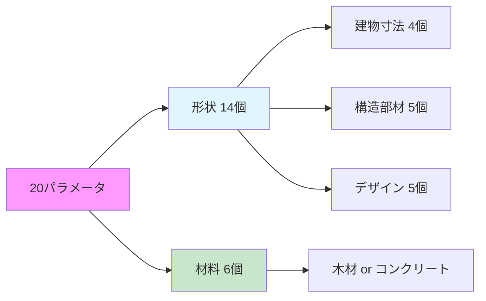

# `generate_building_fem_analyze.py` 詳細レポート


## 🎯 概要

`generate_building_fem_analyze.py`は，FreeCADを使用して建築構造の自動生成とFEM（有限要素法）解析を行う中核モジュールです．

このシステムは、建築設計の最適化プロセスを自動化することを目的として開発されました。従来、建築設計では構造安全性、コスト、環境負荷などの複数の要素を手動で調整しながら最適解を探す必要がありましたが、本モジュールはこのプロセスを完全に自動化します。20個の設計パラメータを入力として受け取り、3次元建物モデルを自動生成し、構造解析を実行した後、5つの観点から性能を定量的に評価します。

特に重要なのは、このシステムがパラメトリック設計に対応している点です。これにより、粒子群最適化（PSO）などの最適化アルゴリズムと組み合わせることで、数千・数万の設計案を自動的に生成・評価し、最適な建築設計を発見することが可能になります。

### 🎆 主要機能


### 🏗️ 評価指標

本システムでは、建築物の性能を5つの観点から総合的に評価します。これらの指標は、実際の建築プロジェクトで重視される要素を反映しており、相互にトレードオフの関係にある場合も多く、最適化の際にはバランスを考慮する必要があります。

| 指標 | 内容 | 目標 |
|:---:|---|:---:|
| 🔒 **安全性** | 構造安全率（応力/変形） | <span style="color: #4CAF50; font-weight: bold;">⬆️ 最大化</span> |
| 💰 **経済性** | 建設コスト [円/m²] | <span style="color: #FF5722; font-weight: bold;">⬇️ 最小化</span> |
| 🌱 **環境性** | CO2排出量 [kg-CO2/m²] | <span style="color: #FF5722; font-weight: bold;">⬇️ 最小化</span> |
| 🏠 **快適性** | 居住快適性スコア [0-10] | <span style="color: #4CAF50; font-weight: bold;">⬆️ 最大化</span> |
| 🔨 **施工性** | 施工難易度スコア [0-10] | <span style="color: #4CAF50; font-weight: bold;">⬆️ 最大化</span> |

各指標は独立して計算されますが、例えば安全性を高めるために構造部材を大きくすると、コストとCO2排出量が増加し、施工性が低下する可能性があります。このような複雑な関係性を考慮しながら、最適なバランスを見つけることが本システムの重要な役割です。

## 📁 ファイル構造

### 🗺️ コードマップ (4200行以上)

本モジュールは4200行を超える大規模なPythonコードで構成されています。コードは機能ごとに明確に区分されており、各セクションが独立した責任を持つように設計されています。以下の図は、ファイル内の主要な構成要素とその行番号を示しています。


建物生成セクション（青色）が最も大きな部分を占めており、これは複雑な3次元形状を生成するための詳細な処理が含まれているためです。FEM解析セクション（緑色）も同様に大規模で、構造解析のための複雑な数値計算処理を含んでいます。評価関数セクション（紫色）では、解析結果を基に5つの性能指標を計算する処理が実装されています。

### 📊 主要セクション詳細

| 🎨 セクション | 📐 行範囲 | 📦 内容 | 📝 主要関数 |
|:---|:---:|---|---|
| **📝 ヘッダー部** | 1-75 | • エンコーディング宣言<br/>• モジュールインポート<br/>• グローバル設定 | `VERBOSE_OUTPUT`<br/>`FEM_AVAILABLE` |
| **📊 データクラス** | 189-205 | 建物パラメータの格納 | `BuildingParameters` |
| **🏠 屋根関連** | 211-491 | かまぼこ屋根の生成 | `calculate_roof_curvature()`<br/>`create_parametric_barrel_roof()` |
| **🏞️ バルコニー** | 493-543 | バルコニーと手すり | `create_balcony()` |
| **🏛️ メイン建物** | 545-1392 | 建物全体の統合生成 | `create_realistic_building_model()` |
| **🔬 FEM解析** | 1515-2773 | 構造解析の実行 | `run_fem_analysis()` |
| **📋 評価関数** | 2760-4086 | 5つの評価指標計算 | `calculate_safety_factor()`<br/>`calculate_economic_cost()`<br/>`calculate_environmental_impact()`<br/>`calculate_comfort_score()`<br/>`calculate_constructability_score()` |
| **🎯 統合関数** | 4086-4200 | パラメータから評価まで | `evaluate_building_from_params()` |

## 🔗 関数コール構造

### 🎯 メイン処理フロー

システムの処理は、パラメータ入力から性能評価まで、4つの主要なステップで構成されています。各ステップは前のステップの出力を入力として受け取り、パイプライン形式で処理が進行します。この設計により、各ステップを独立して最適化・改善することが可能です。


最初のステップでは、20個の設計変数（建物の寸法、材料、デザイン要素など）を受け取ります。次に、FreeCADのAPIを使用してこれらのパラメータから3次元建物モデルを自動生成します。生成されたモデルは、CalculiXソルバーに渡されてFEM構造解析が実行されます。最後に、解析結果と建物情報を基に、5つの性能指標（安全性、経済性、環境性、快適性、施工性）が計算されます。

このフロー全体は通常30秒から2分程度で完了し、完全に自動化されているため、大量の設計案を効率的に評価することが可能です。

### 2. ユーティリティ関数

| 関数名 | 行番号 | 概要 |
|---|---|---|
| `get_material_name()` | 134 | 材料番号から名前への変換（0:コンクリート，1:木材） |
| `is_gui_mode()` | 1383 | GUI環境の判定（FreeCADGui利用可能かチェック） |
| `safe_remove_object()` | 1402 | 安全なオブジェクト削除（エラー抑制付き） |
| `safe_set_visibility()` | 1425 | 安全な可視性設定（GUI環境でのみ動作） |
| `safe_gui_operations()` | 1459 | GUI操作の安全実行（エラーハンドリング付き） |
| `setup_deterministic_fem()` | 1490 | 決定論的FEM設定（メッシュ生成の再現性確保） |
| `clean_document_for_fcstd_save()` | 3960 | FCStd保存前のクリーンアップ（不要オブジェクト削除） |

## 🏛️ パラメータから建物を作るプロセス

### 🌟 20個の設計パラメータ

本システムの特徴の一つは、建物の設計を20個のパラメータで完全に定義できる点です。これらのパラメータは、実際の建築設計で考慮される主要な要素を網羅しており、形状に関する14個のパラメータと材料選択に関する6個のパラメータ、そして基礎（常にコンクリート固定）で構成されています。



形状パラメータは建物の基本的な大きさ、構造部材の寸法、そして建築的なデザイン要素を制御します。これらは連続値として扱われ、最適化アルゴリズムが滑らかに探索できるようになっています。一方、材料パラメータは離散値（0:コンクリート、1:木材）として扱われ、各構造部材の材料を独立して選択できます。この柔軟性により、例えば「柱はコンクリート、屋根は木材」といったハイブリッド構造も表現可能です。

### 📊 パラメータ詳細

#### 🏗️ 形状パラメータ（14個）

##### 📏 建物寸法
| 変数 | パラメータ名 | 単位 | 範囲 | 説明 |
|:---:|:---|:---:|:---:|---|
| $x_1$ | `Lx` | m | 5.0-20.0 | 建物幅（東西方向） |
| $x_2$ | `Ly` | m | 4.0-15.0 | 建物奥行き（南北方向） |
| $x_3$ | `H1` | m | 2.5-5.0 | 1階高 |
| $x_4$ | `H2` | m | 2.5-4.0 | 2階高 |

##### 🏛️ 構造部材
| 変数 | パラメータ名 | 単位 | 範囲 | 説明 |
|:---:|:---|:---:|:---:|---|
| $x_5$ | `tf` | mm | 150-400 | 床スラブ厚 |
| $x_6$ | `tr` | mm | 100-300 | 屋根スラブ厚 |
| $x_7$ | `bc` | mm | 200-600 | 柱幅（正方形断面） |
| $x_8$ | `hc` | mm | 200-600 | 柱厚 |
| $x_9$ | `tw_ext` | mm | 150-300 | 外壁厚 |

##### 🎨 デザイン要素
| 変数 | パラメータ名 | 単位 | 範囲 | 説明 |
|:---:|:---|:---:|:---:|---|
| $x_{10}$ | `wall_tilt_angle` | 度 | -40.0～30.0 | 壁傾斜角度 |
| $x_{11}$ | `window_ratio_2f` | - | 0.0-0.8 | 2階窓面積率 |
| $x_{12}$ | `roof_morph` | - | 0.0-1.0 | 屋根形状<br/>0.0:平坦<br/>0.5:標準<br/>1.0:急勾配 |
| $x_{13}$ | `roof_shift` | - | -1.0～1.0 | 屋根非対称性<br/>負:左偏り<br/>0:対称<br/>正:右偏り |
| $x_{14}$ | `balcony_depth` | m | 0.0-3.0 | バルコニー奥行き |

#### 🧪 材料選択パラメータ（6個）

| 変数 | パラメータ名 | 選択肢 | 説明 | 注記 |
|:---:|:---|:---:|---|---|
| $x_{15}$ | `material_columns` | 0 / 1 | 柱材料 | 0:🪨 コンクリート<br/>1:🌳 木材 |
| $x_{16}$ | `material_floor1` | 0 / 1 | 1階床材料 | 同上 |
| $x_{17}$ | `material_floor2` | 0 / 1 | 2階床材料 | 同上 |
| $x_{18}$ | `material_roof` | 0 / 1 | 屋根材料 | 同上 |
| $x_{19}$ | `material_walls` | 0 / 1 | 外壁材料 | 同上 |
| $x_{20}$ | `material_balcony` | 0 / 1 | バルコニー材料 | 同上 |

> 💡 **注意**: 基礎は常にコンクリート（地中埋設部の高耐久性要件のため）

### 🌐 建物生成プロセス

パラメータから実際の3次元建物モデルを生成するプロセスは、複数の段階を経て実行されます。このプロセスは、実際の建築施工の順序を模倣しており、基礎から始まり、柱、床、壁、屋根と順番に構築していきます。各段階でエラーハンドリングが実装されており、部分的な失敗があっても可能な限り処理を継続します。

#### 🔄 全体の流れ


#### 🏗️ 構造部品の詳細

| 🏗️ 部品 | 📦 仕様 | 🔍 特記事項 | 🧪 材料 |
|:---:|---|---|:---:|
| **🪨 基礎**<br/>(Foundation) | • 寸法: 建物幅×奥行×400mm<br/>• 位置: Z=-400mm（地下） | 地中埋設部の高耐久性要件<br/>建築基準法準拠 | 固定:コンクリート |
| **🔳 床スラブ**<br/>(Floor1/2) | • 1階床: Z=0mm<br/>• 2階床: Z=H1位置<br/>• 階段開口: 1000×2000mm | 2階床には階段終端位置に<br/>合わせた開口設置 | 選択可 |
| **🏛️ 柱**<br/>(Columns) | • 基本配置: 四隅+中央（5本）<br/>• 断面: bc×hc mm | 傾斜角度に応じた位置調整<br/>±25°以上で補強柱追加 | 選択可 |
| **🏠 屋根**<br/>(RoofSlab) | • 形状: `roof_morph`で制御<br/>• 非対称: `roof_shift`で制御 | かまぼこ屋根形状<br/>内傾斜時は幅調整 | 選択可 |
| **🪧 外壁**<br/>(Walls) | • 1階: ピロティ（最小限）<br/>• 2階: 四面壁<br/>• 窓面積率: `window_ratio_2f` | 東:傾斜壁<br/>西:バルコニードア<br/>南北:窓開口 | 選択可 |
| **🏞️ バルコニー**<br/>(Balcony) | • 位置: 西側2階<br/>• 手すり高: 1100mm<br/>• 奥行: `balcony_depth` | 安全基準準拠の手すり高 | 選択可 |
| **🪜 階段**<br/>(Staircase) | • 形状: L字型外部階段<br/>• 踏面300mm，蹴上200mm | FEM解析から除外<br/>（構造的に分離） | - |

#### 2.3 形状の統合と最適化

1.  **部品の融合 (Fusion)**: 基礎から順番に全部品を結合し，最終的に単一のソリッド形状を生成します．エラー処理により部分的な失敗も許容されます．
2.  **マテリアル情報の付与**: 各部品に材料タイプ（0:コンクリート, 1:木材）を設定し，FEM解析用の材料特性と連携させます．
3.  **可視性とGUI設定**: GUI環境でのみ色設定を実行し，全部品の可視性を確保します．

#### 2.4 特殊な処理

*   **傾斜壁の対応**: 壁の上端位置を計算し，窓開口の位置と大きさを動的に調整します．極端な角度では追加の安全対策が講じられます．
*   **材料別の自動調整**: 材料強度に応じて断面寸法を自動調整します（木材系は一般的に大きな断面が必要）．
*   **エラーハンドリング**: 各生成段階でtry-except処理が実装されており，部分的な失敗でも継続可能な設計となっています．

### 3. 3Dモデルの構成要素

`create_realistic_building_model()`で以下の部品が生成されます：

*   **基礎** (Foundation) - 400mm厚のコンクリート基礎
*   **1階床** (Floor1) - ピロティ構造の床スラブ
*   **柱** (Columns) - 4本の角柱
*   **2階床** (Floor2) - 2階の床スラブ
*   **外壁** (Walls) - 窓開口付きの2階外壁
*   **屋根** (RoofSlab) - かまぼこ屋根または平屋根
*   **階段** (Staircase) - 外部階段
*   **バルコニー** (Balcony) - オプション

## 評価プロセス

建物モデルが生成された後、その性能を評価するプロセスが開始されます。評価の中核となるのがFEM（有限要素法）解析で、これにより建物の構造的な強度と変形を詳細に計算します。FEM解析の結果は、その後の5つの評価指標の計算に使用されます。

### 1. FEM解析

FEM解析は、連続体である建物を有限個の要素に分割し、各要素での物理的挙動を数値的に解くことで、全体の構造応答を予測する手法です。本システムでは、オープンソースの構造解析ソルバーであるCalculiXを使用しています。

| 項目 | 詳細 |
|---|---|
| **メッシュ生成** | Gmshを使用し，3D自動メッシュを生成．`CharacteristicLengthMax`: 600mm，`CharacteristicLengthMin`: 200mm．`NumThreads`: 2（安定性向上）． |
| **荷重条件** | **自重**: 全構造体に9.81 m/s²の重力加速度を適用（材料密度に基づく）．<br>**積載荷重**: 住宅床面: 1800 Pa，屋根面: 10000 Pa × 荷重低減係数（屋根形状による），バルコニー床面: 1800 Pa．<br>**地震荷重**: 基本設定: 地震係数 0.5G．建物南側面に水平圧力として適用．材料別応答増幅（コンクリート: 1.0倍，木材: 1.5倍）．<br>**注記**: 風荷重は現在の実装には含まれていません． |
| **解析実行** | CalculiXソルバーで線形静的解析を実行．応力分布（von Mises応力，主応力），変位量，ひずみ分布を出力．最大値を安全性評価に使用． |

### 2. 評価指標の計算

#### 2.1 構造安全性 (Safety Factor)

| 項目 | 詳細 |
|---|---|
| **計算式** | `安全率 = min(応力による安全率, 変形による安全率)`<br>`応力による安全率 = 許容応力 / 最大応力`<br>`変形による安全率 = 許容変形 / 最大変形` |
| **材料別許容応力** (短期許容応力) | コンクリート: 35.0 MPa（C30/37相当の短期許容圧縮応力），木材: 6.0 MPa（構造用集成材の短期許容圧縮応力）．柱40%，壁30%，床30%の加重平均で許容応力を計算． |
| **変形制限** | 層間変形角: 1/200以下．木造の場合，変形制限を0.3倍（70%厳しく評価）．繰返し荷重疲労係数: 0.6～0.7（材料により異なる）． |
| **安全率の目標値** | 目標安全率: 2.0以上（通常の安全基準）．最小許容安全率: 1.0（これ以下は構造的に危険）． |

#### 2.2 経済性 (Cost)

| 項目 | 詳細 |
|---|---|
| **総工事費の構成** | `総工事費 = 構造工事費 + 基本建築費 + 特殊要素費` |
| **材料費** | コンクリート: 20,000円/m³，木材: 15,000円/m³．材料選択による断面増加を考慮（木材は1.2～1.5倍）． |
| **労務費** | コンクリート工事: 25,000円/m³，木材工事: 45,000円/m³，型枠工事: 10,000円/m²，鉄筋工事: 150円/kg． |
| **構造複雑度による補正** | 柱断面過大（>400×400mm），床版厚過大（>200mm），壁傾斜（傾斜角10度で10%コスト増），全木造（5箇所）: +10%，木造主体（3箇所以上）: +5%などにより対数的コスト増加． |
| **特殊要素コスト** | 外部階段: 1,500,000円（固定），バルコニー: 深さに応じて200,000～800,000円，かまぼこ屋根: 曲率に応じて追加コスト． |


#### 2.3 環境負荷 (CO2 Emission)

| 項目 | 詳細 |
|---|---|
| **CO2排出量の内訳** | `CO2総排出量 = 材料製造CO2 + 鉄筋CO2 + 運搬CO2 + 施工CO2` |
| **材料別CO2排出係数** | コンクリート: 300 kg-CO2/m³（環境配慮型セメント使用），木材: 50 kg-CO2/m³（製造・加工・輸送のCO2）．リサイクル材使用時: 排出量を20%削減． |
| **追加的CO2排出** | 鉄筋: 2.0 kg-CO2/kg（150kg/m³使用），運搬: 0.1 kg-CO2/kg-km（50km想定），施工: コンクリート50，木材30 kg-CO2/m³． |
| **最適化ポテンシャル** | FEM解析で安全率>3.0の場合: 材料削減により20～40%のCO2削減可能．応力分布の均一性が高い場合: さらに10%の削減余地． |


#### 2.4 快適性 (Comfort Score)

| 評価項目 | 配点割合 | 詳細 |
|---|---|---|
| **空間の広がり感** | 25% | 天井高（4.0m以上で満点，2.4m未満で大幅減点），スパン長（15m以上で満点，8m未満で減点）で評価． |
| **採光・眺望** | 25% | 窓面積率（0.3～0.5が理想），階高による眺望，南向き窓の評価加点． |
| **ピロティ開放感** | 20% | 1階開放率70%による開放感，柱の細さによる視界の良さ，外部との連続性． |
| **プライバシー** | 10% | 2階窓配置の適切性，近隣との視線交錯の少なさ． |
| **構造的安心感** | 10% | 変位量が小さいほど高評価（10mm未満で満点，30mm以上で減点）． |
| **デザイン要素** | 10% | 傾斜壁，特殊屋根による減点．バルコニーによる加点． |


#### 2.5 施工性 (Constructability)

施工性は基本スコア10点から開始し、施工を複雑にする要因により減点、簡略化する要因により加点します。

**基本スコア**: 10点（単純箱型構造）

##### 施工性評価の概要

| 評価要素 | ポイント範囲 | 主な要因 |
|---|:---:|---|
| **構造的複雑さ** | **-4.0 ～ 0点** | カンチレバー、外部階段、開口部 |
| **形状の特殊性** | **-3.0 ～ 0点** | 壁傾斜、屋根形状、バルコニー |
| **材料・寸法** | **-2.5 ～ 0点** | 過大断面、異種材料、高所作業 |
| **簡略化要因** | **0 ～ +1.5点** | ピロティ構造、標準寸法使用 |

##### 主要な減点・加点項目

| 項目 | ポイント | 説明 |
|---|:---:|---|
| カンチレバー | **-2.0** | 特殊支保工必要 |
| 外部階段 | **-1.5** | 別途施工 |
| 急曲率屋根 | **-1.5** | roof_morph ≥ 0.7 |
| 過大断面 | **-1.0** | 標準の1.5倍以上 |
| ピロティ構造 | **+1.0** | 型枠簡略化 |


### 2.6 評価指標の詳細計算式

各評価指標の計算において、FEM解析の結果は重要な役割を果たします。FEM解析から得られる主要な出力は以下の3つです：

1. **応力分布（Stress Distribution）**: 建物の各部位に発生する内部応力を示します。特に最大von Mises応力は、材料の降伏条件を評価する上で重要な指標となります。
2. **変位分布（Displacement Distribution）**: 荷重による建物の変形量を示します。最大変位は、建物の使用性や居住快適性に直接影響します。
3. **ひずみ分布（Strain Distribution）**: 材料の局所的な変形率を示します。過大なひずみは、亀裂や破壊の前兆となる可能性があります。

これらのFEM解析結果は、以下のように各評価指標の計算に活用されます：

#### 安全率の計算式

FEM解析から得られる最大応力と最大変位を使用して、構造安全率を2つの観点から評価します。
```python
# FEM解析結果から最大応力と最大変位を取得
max_stress = fem_results['max_von_mises_stress']  # MPa単位
max_displacement = fem_results['max_displacement']  # mm単位

# 材料別許容応力の加重平均
avg_allowable = (
    material_allowable[columns] * 0.4 +  # 柱: 40%
    material_allowable[walls] * 0.3 +    # 壁: 30%
    material_allowable[floors] * 0.3     # 床: 30%
)

# 応力による安全率（FEM解析の最大応力を使用）
stress_safety = avg_allowable / max_stress

# 変形による安全率（FEM解析の最大変位を使用）
allowable_displacement = building_height_mm / 200  # 層間変形角1/200
displacement_safety = allowable_displacement / max_displacement
if is_wood_structure:
    displacement_safety *= 0.3  # 木造は70%厳しく評価
    displacement_safety *= fatigue_factor  # 疲労係数0.6-0.7

# 最終安全率（小さい方を採用）
safety_factor = min(stress_safety, displacement_safety)
```

上記のように、FEM解析から得られた最大応力と最大変位が、直接的に構造安全率の計算に使用されます。これにより、実際の構造挙動に基づいた正確な安全性評価が可能となります。

#### コスト計算式

コスト計算では、FEM解析結果を間接的に利用します。安全率が過剰に高い場合、材料の無駄遣いを示唆するため、最適化の余地があると判断されます。
```python
# 材料費（材料体積 × 単価 × リサイクル率考慮）
material_cost = Σ(
    part_volume * unit_cost * (1 - recycle_ratio) +
    part_volume * unit_cost * recycle_cost_factor * recycle_ratio
)

# 構造体積係数（対数的増加）
structural_volume_factor = 1.0 + (
    0.3 * log(column_oversize) +
    0.2 * log(floor_oversize) +
    0.1 * log(roof_oversize) +
    0.1 * log(wall_oversize)
) * material_factor * 0.8

# 総工事費
total_cost = (
    (material_cost + labor_cost + rebar_cost + formwork_cost) * 
    structural_complexity * quality_grade_factor * structural_volume_factor +
    base_building_cost * complexity_factor +
    special_element_cost
)
```

#### CO2排出量計算式

CO2排出量の計算では、FEM解析の安全率結果を使用して、材料削減の可能性を評価します。

```python
# FEM解析から得られた安全率を使用
safety_factor = fem_results['safety_factor']

# 材料別CO2（リサイクル率考慮）
material_co2 = Σ(
    part_volume * co2_per_m3 * (1 - recycle_ratio) +
    part_volume * co2_per_m3 * recycle_co2_factor * recycle_ratio
)

# 総CO2排出量
total_co2 = (
    material_co2 +                          # 材料製造
    rebar_kg * 2.0 +                       # 鉄筋製造
    total_material_kg * 0.05 * 0.1 +       # 運搬(50km)
    concrete_volume * 50 + wood_volume * 30 # 施工
)

# FEM解析の安全率から最適化ポテンシャルを計算
# 安全率が3.0を超える場合、過剰設計として材料削減可能
if safety_factor > 3.0:
    optimization_potential = 0.2 + (safety_factor - 3.0) * 0.05
    # この値を使って、将来的な材料削減によるCO2削減量を推定
```

#### 快適性スコア計算式

快適性評価では、FEM解析の変位結果を使用して、構造的な安心感を評価します。
```python
# FEM解析の変位結果を取得
max_displacement = fem_results['max_displacement']  # mm単位

# 各項目のスコア計算（-10～20の範囲）
height_score = f(avg_height)  # 天井高評価
span_score = f(avg_span)      # スパン長評価

# FEM解析の変位から構造的安心感を評価
# 変位が小さいほど高評価（居住者の安心感に直結）
if max_displacement < 10:
    structural_confidence = 10  # 優秀
elif max_displacement < 20:
    structural_confidence = 5   # 良好
elif max_displacement < 30:
    structural_confidence = 0   # 標準
else:
    structural_confidence = -10 # 不安を感じるレベル

# 重み付け合計
raw_comfort_score = (
    spaciousness * 0.25 +      # 空間の広がり感: 25%
    lighting * 0.25 +          # 採光・眺望: 25%
    piloti_openness * 0.20 +   # ピロティ開放感: 20%
    privacy * 0.10 +           # プライバシー: 10%
    structural_confidence * 0.10 + # 構造的安心感: 10%（FEM結果を使用）
    design_elements * 0.10     # デザイン要素: 10%
)

# 0-10スケールに正規化
comfort_score = max(0, min(10, 5 + raw_comfort_score * 0.5))
```

上記のように、FEM解析の変位結果が構造的安心感の評価に直接使用され、快適性スコアの一部を構成します。

#### 施工性スコア計算式

施工性評価では、FEM解析の結果を使用して、構造の複雑さが施工に与える影響を間接的に評価します。
```python
# FEM解析結果から応力集中を確認
stress_concentration = fem_results['stress_concentration_factor']

# 基本スコアから減点
constructability_score = 10.0

# 構造的複雑さによる減点
if has_cantilever: score -= 2.0
if has_stairs: score -= 1.5
score -= opening_complexity * 0.5

# 形状特殊性による減点
score -= abs(wall_tilt_angle) / 10.0
if roof_morph < 0.2: roof_penalty = 0
elif roof_morph < 0.7: roof_penalty = 0.5
else: roof_penalty = 1.5
score -= roof_penalty

# FEM解析から応力集中がある場合、補強工事が必要なため減点
if stress_concentration > 2.0:
    score -= 1.0  # 局所的な補強が必要
    
# ピロティ構造による加点
score += 1.0  # 型枠簡略化

# 最終スコア（0-10範囲）
constructability_score = max(0, min(10, score))
```

このように、FEM解析の応力集中係数を確認し、局所的な補強が必要な箇所がある場合は施工の複雑さが増すため、施工性スコアを減点します。

### FEM解析結果の活用まとめ

| 評価指標 | FEM結果の使用 | 主な入力データ | 具体的な利用項目 |
|---|---|---|---|
| **🔒 安全性** | ✅ **必須** | FEM結果（最大応力、最大変位）+ 材料情報 | 応力による安全率、変位による安全率の算出 |
| **💰 経済性** | ❌ **不使用** | 建物情報のみ（体積、材料、寸法） | 材料費、労務費、形状複雑度から直接計算 |
| **🌱 環境性** | △ **オプション** | 建物情報がメイン、FEM結果は最適化評価のみ | 過剰設計の判定（安全率>3.0で材料削減可能） |
| **🏠 快適性** | △ **一部使用** | 建物情報がメイン、FEM結果の変位を安心感評価に使用 | 変位<5mmで構造的安心感をボーナス加点 |
| **🔨 施工性** | △ **オプション** | 建物情報がメイン、FEM結果は応力集中評価のみ | 応力集中係数>2.0で局所補強による減点 |

**重要なポイント：**
- **安全性のみがFEM結果に完全依存**しており、FEM解析なしでは評価不可能です
- **経済性は完全に独立**しており、FEM結果を一切使用しません
- **その他3指標**は主に建物の幾何学的情報や材料情報から計算され、FEM結果は補助的に使用されます

このように、FEM解析は主に構造安全性の確認に使用され、他の評価指標は建物の設計情報から直接計算されることで、計算効率と評価の独立性を保っています。

### 3. 結果の返却

評価結果は辞書形式で返却されます．以下は計算結果の例です．

| カテゴリ | 項目 | 説明 | 例 | 単位 |
|---|---|---|---|---|
| `status` | | 処理状態 | `Success` | - |
| `safety` | `overall_safety_factor` | 構造安全率（目標: 2.0以上） | 2.15 | - |
| | `max_stress` | 最大応力 | 4.65 | MPa |
| | `max_displacement` | 最大変位 | 12.3 | mm |
| `economic` | `cost_per_sqm` | 単位面積あたりコスト | 125000 | 円/m² |
| | `total_cost` | 総建設コスト | 12000000 | 円 |
| `environmental` | `co2_per_sqm` | 単位面積あたりCO2排出量 | 450 | kg-CO2/m² |
| | `total_co2` | 総CO2排出量 | 43200 | kg-CO2 |
| `comfort` | `comfort_score` | 快適性スコア | 7.5 | 0-10点 |
| | `floor_area` | 床面積 | 96.0 | m² |
| `constructability` | `constructability_score` | 施工性スコア | 8.2 | 0-10点 |

**注**: 上記の値は説明用の例です．実際の値は入力パラメータとFEM解析結果により変動します．

## 使用方法

本モジュールは、Pythonスクリプトから直接呼び出して使用します。主に2つの使用方法があります：パラメータ辞書を使用した簡単な方法（推奨）と、より詳細な制御が必要な場合の直接関数呼び出しです。いずれの方法でも、FreeCAD環境が必要となるため、通常のPython環境ではなく、FreeCADのPython環境（freecadcmd）から実行する必要があります。

### 基本的な使い方

#### 1. パラメータ辞書からの建物評価（推奨）

```python
from generate_building_fem_analyze import evaluate_building_from_params

# パラメータ辞書を準備
params = {
    # 基本形状パラメータ
    'Lx': 8.0,          # 建物幅 [m]
    'Ly': 6.0,          # 建物奥行き [m]
    'H1': 3.5,          # 1階高 [m]
    'H2': 3.0,          # 2階高 [m]
    'tf': 250,          # 床スラブ厚 [mm]
    'tr': 150,          # 屋根スラブ厚 [mm]
    'bc': 400,          # 柱幅 [mm]
    'hc': 400,          # 柱厚 [mm]
    'tw_ext': 200,      # 外壁厚 [mm]
    
    # 追加パラメータ
    'wall_tilt_angle': 0.0,    # 壁傾斜角 [度] (-40.0 to 30.0)
    'window_ratio_2f': 0.4,    # 2階窓面積率 (0.0-0.8)
    'roof_morph': 0.5,         # 屋根形状 (0.0-1.0)
    'roof_shift': 0.0,         # 屋根非対称性 (-1.0 to 1.0)
    'balcony_depth': 1.5,      # バルコニー奥行き [m]
    
    # 材料選択（0:コンクリート, 1:木材）
    'material_columns': 0,     # 柱材料
    'material_floor1': 0,      # 1階床材料
    'material_floor2': 0,      # 2階床材料
    'material_roof': 0,        # 屋根材料
    'material_walls': 0,       # 外壁材料
    'material_balcony': 0      # バルコニー材料
}

# 評価実行
results = evaluate_building_from_params(
    params, 
    save_fcstd=True,                    # FCStdファイルを保存
    fcstd_path='test_building.FCStd'    # 保存パス
)

# 結果確認
print(f"構造安全率: {results['safety_factor']}")
print(f"建設コスト: {results['cost']} 円")
print(f"CO2排出量: {results['co2_emission']} kg-CO2")
```

#### 2. 直接関数呼び出し（詳細制御が必要な場合）

```python
from generate_building_fem_analyze import (
    create_realistic_building_model,
    run_fem_analysis,
    evaluate_structural_safety,
    evaluate_economy,
    evaluate_environmental_impact
)

# 建物モデル生成
doc, building_obj, building_info = create_realistic_building_model(
    Lx=8.0, Ly=6.0, H1=3.5, H2=3.0,
    tf=250, tr=150, bc=400, hc=400, tw_ext=200,
    wall_tilt_angle=0.0,
    window_ratio_2f=0.4,
    roof_morph=0.5,
    roof_shift=0.0,
    balcony_depth=1.5
)

# FEM解析実行
fem_results = run_fem_analysis(doc, building_obj, mesh_size_mm=200)

# 各種評価
safety = evaluate_structural_safety(fem_results)
economy = evaluate_economy(building_info)
environmental = evaluate_environmental_impact(building_info)
```

### パラメータ範囲と推奨値

詳細なパラメータ範囲と推奨値については，[パラメータ詳細](#パラメータ詳細)セクションを参照してください．

## 主要な特徴

本システムの開発において重視した特徴を以下に示します。これらの特徴により、建築設計の自動最適化という複雑な課題に対して、実用的なソリューションを提供しています。

### 1. パラメトリック設計

パラメトリック設計は、建物の形状を数値パラメータで制御する手法です。本システムでは20個のパラメータを使用して、無限に近い設計バリエーションを生成できます。

- 20個の設計パラメータで多様な建物形状を生成
  - 基本形状パラメータ: 14個
  - 材料選択パラメータ: 6個（`material_columns`，`material_floor1`，`material_floor2`，`material_roof`，`material_walls`，`material_balcony`）
  - 材料選択肢: 0:コンクリート，1:木材
  - 注：基礎は最適化対象外（常にコンクリート）
- かまぼこ屋根の形状を2つのパラメータで制御
- 材料に応じた断面寸法の自動調整機能

### 2. コード品質の向上（2025-07-24）
- 全主要関数に詳細なdocstringを追加
  - 関数の目的と処理内容の明確化
  - 引数の型，単位，値の範囲を明記
  - 戻り値の構造と意味を詳細に記述
- 不要な可視化関数を削除してコードを簡潔化
- 材料選択と評価プロセスの文書化を強化
- 未使用変数のコメント化（target_safety_factor）
- パラメータ範囲の明確な文書化（roof_morph: 0.0-1.0，roof_shift: -1.0 to 1.0）

### 3. 包括的な構造解析
- CalculiXによる高精度FEM解析
- 自重，積載荷重，風荷重を考慮

### 4. 多目的評価
- 構造安全性（安全率）
- 経済性（建設コスト）
- 環境性（CO2排出量）
- 快適性（空間品質）
- 施工性（施工難易度）

### 5. エラーハンドリング
- 各処理段階でのエラーキャッチ
- フォールバック機構（簡略化モデル）

## 使用上の注意

### 必須環境
- FreeCAD 1.0.0以上
- CalculiX（FEMソルバー）
- Gmsh（メッシュ生成）

### メモリ使用
- 複雑なモデルでは大量のメモリを使用
- 推奨: 8GB以上のRAM

### 実行時間
- 1モデルあたり30秒〜2分（モデル複雑度による）

### 推奨設定
- Gmsh NumThreads: 2（安定性向上，0だと全コア使用）
- メッシュサイズ: 200-600mm

## トラブルシューティング

### よくある問題
1. **Segmentation Fault**
   - Gmshのスレッド数を1または2に設定
   - メッシュサイズを大きくする

2. **メモリ不足**
   - モデルを簡略化
   - メッシュサイズを大きくする

3. **解析収束しない**
   - 境界条件を確認
   - 荷重条件を段階的に適用

4. **FEMモジュールエラー（'Fem::FemAnalysis' is not a document object type）**
   - 親ディレクトリにFem.pyファイルがある場合，モジュール名の競合が発生
   - 解決策：Pythonパスから親ディレクトリを除外し，現在のディレクトリのみを追加
   - test_generate_building.pyで実装済みの修正を参照

## 材料選択機能詳細

### サポートされる材料

1. **コンクリート（material_value = 0）**
   - 標準的なRC構造
   - 高い圧縮強度と耐久性
   - 最も汎用的な選択肢

2. **木材（material_value = 1）**
   - 構造用集成材
   - 軽量で環境負荷が低い
   - 炭素固定効果によりCO2排出量がマイナス

### 材料選択による自動調整

- **床スラブ厚**: 木材選択時は自動的に厚みを増加（×1.5）
- **柱断面**: 木材選択時は断面を増加（×1.2）
- **壁厚**: 木材選択時は×1.5

### 材料別の特徴比較

| 項目 | コンクリート | 木材 |
|------|------------|------|
| 初期コスト | 20,000円/m³ | 50,000円/m³ |
| CO2排出量 | 410 kg/m³ | -836 kg/m³ |
| ヤング率 | 33,000 MPa | 11,000 MPa |
| 密度 | 2400 kg/m³ | 500 kg/m³ |
| 減衰定数 | 5% | 3% |
| 地震応答増幅 | 1.0倍 | 1.5倍 |
| 耐久性 | 高 | 中 |
| メンテナンス | 低 | 中 |


