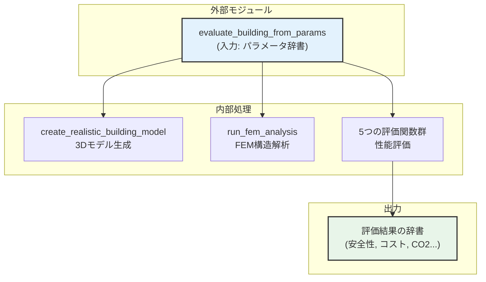

# `generate_building_fem_analyze.py` 機能解説書 (詳細版)

---

## 1. このモジュールの役割：設計図から性能評価までを自動化

`generate_building_fem_analyze.py`は、このプロジェクトにおける**建築物の自動生成と性能評価を担う心臓部**です。PSOアルゴリズムが提案する設計パラメータ（設計図）を受け取り、3Dモデル生成から構造解析、多角的な性能評価までを全自動で行います。

### アーキテクチャと主要な関数連携

外部から呼び出されるメイン関数 `evaluate_building_from_params` を起点に、内部の各専門関数が連携して処理を進めます。



この一連の流れにより、抽象的なパラメータの羅列から、具体的な性能指標を持つ建築モデルへと変換します。

---

## 2. 入力：20個の設計パラメータ

このモジュールは、建物の形状や材料を定義する20個のパラメータを辞書形式で受け取ります。

- **形状パラメータ (14個)**: 建物の寸法、構造部材のサイズ、デザイン要素を定義します。
- **材料パラメータ (6個)**: 柱や床など、主要な構造部材の材料をコンクリート(0)か木材(1)から選択します。

*(パラメータ一覧のテーブルは前回と同様のため省略)*

> **Note:** 基礎は耐久性を考慮し、常にコンクリートで生成されます。

---

## 3. 処理プロセス：モデル生成からFEM解析まで

### Step 1: 3Dモデルの生成 (`create_realistic_building_model`)

入力されたパラメータに基づき、FreeCADの機能を使って構造部品を順次生成し、最終的に一つの建物モデルに統合します。

- **特徴的な処理**:
  - **かまぼこ屋根**: `roof_morph`と`roof_shift`の値に応じて、湾曲した屋根や非対称な屋根を生成します。
  - **傾斜壁**: `wall_tilt_angle`に応じて壁を傾け、窓の開口部も追従して自動調整します。
  - **材料による自動調整**: 木材を選択した場合、コンクリートよりも強度を確保するために、柱の断面などを自動的に太くします。

### Step 2: FEM解析の実行 (`run_fem_analysis`)

生成された3Dモデルに対して、構造的な安全性を検証するためのFEM（有限要素法）解析を行います。

1.  **メッシュ生成**: モデルを解析可能な小さな要素（メッシュ）に分割します。(Gmshを使用)
2.  **荷重・拘束条件の設定**: 現実世界で建物にかかる力をシミュレーション上で再現します。

    ```mermaid
    graph TD
        subgraph Building Model
            direction LR
            R(Roof)
            F(Floor)
            W(Wall)
            B(Base)
        end

        subgraph "Loads and Constraints"
            G["Gravitational Load\n(自重)"]
            L["Live Load\n(積載荷重)"]
            E["Earthquake Load\n(地震荷重)"]
            Fix["Fixed Constraint\n(基礎固定)"]
        end

        G --> R
        G --> F
        G --> W
        G --> B
        L --> R
        L --> F
        E --> W
        Fix --> B

        style R fill:#f9f9f9,stroke:#333
        style F fill:#f9f9f9,stroke:#333
        style W fill:#f9f9f9,stroke:#333
        style B fill:#f9f9f9,stroke:#333
    ```

3.  **解析実行**: 上記の条件で、構造計算ソルバーCalculiXが応力（部材内部に発生する力）と変位（部材の変形量）を計算します。

---

## 4. 出力：5つの評価指標

解析結果と建物の情報から、性能を多角的に評価し、結果を辞書形式で返します。PSOはこの評価値を元に、より良い設計案を探します。

| 評価指標 | 概要と評価ロジック | 目標方向 |
|:---:|:---|:---:|
| 🔒 **安全性** | **構造安全率**を算出。部材の**最大発生応力**が材料の許容応力に対してどれだけ余裕があるか、また建物の**最大変形量**が規定値（層間変形角1/200）に対してどれだけ小さいかを評価。 | <span style="color:#4CAF50; font-weight:bold;">最大化</span><br>(目標: 2.0以上) |
| 💰 **経済性** | **建設コスト (円/m²)** を算出。**材料費**と**労務費**を基本とし、複雑な形状（傾斜壁、かまぼこ屋根など）や標準外の部材寸法に対して**コスト増のペナルティ**を加算して算出。 | <span style="color:#FF5722; font-weight:bold;">最小化</span> |
| 🌱 **環境性** | **CO2排出量 (kg-CO2/m²)** を算出。コンクリートや木材などの**材料製造時の排出量**をベースに、運搬や施工に伴う排出量を加算。木材は炭素固定効果により排出量がマイナスになる場合もある。 | <span style="color:#FF5722; font-weight:bold;">最小化</span> |
| 🏠 **快適性** | **居住快適性スコア (0-10点)** を算出。**天井高**や**スパン（柱間距離）**が広いほど高評価。**窓面積率**による採光、**ピロティによる開放感**も加点対象。一方で、特殊なデザインは減点されることもある。 | <span style="color:#4CAF50; font-weight:bold;">最大化</span> |
| 🔨 **施工性** | **施工のしやすさ (0-10点)** を評価。単純な箱型を10点とし、**カンチレバー（片持ち梁）**、**傾斜壁**、**特殊な屋根形状**などの複雑な要素や、標準から外れた部材寸法に応じて減点していく方式。 | <span style="color:#4CAF50; font-weight:bold;">最大化</span> |

### 評価ロジックの例：安全性

安全率は、**「応力」**と**「変形」**の2つの観点から計算され、より厳しい方の値が採用されます。

- **応力による安全率**: `許容される力 / 実際に発生した最大の力`
- **変形による安全率**: `許容される変形量 / 実際に発生した最大の変形量`

木造の場合は変形しやすいため、変形に対する評価がコンクリート造よりも厳しくなるように調整されています。

---

## 5. 使い方：主要関数

このモジュールの機能は、主に`evaluate_building_from_params`関数を通じて利用します。

```python
from generate_building_fem_analyze import evaluate_building_from_params

# 1. 評価したい建物のパラメータを辞書で定義
params = {
    'Lx': 10.0, 'Ly': 8.0, 'H1': 3.2, 'H2': 3.0, 'tf': 200, 'tr': 180, 
    'bc': 350, 'hc': 350, 'tw_ext': 180, 'wall_tilt_angle': -5.0, 
    'window_ratio_2f': 0.4, 'roof_morph': 0.6, 'roof_shift': 0.1, 
    'balcony_depth': 1.2, 'material_columns': 0, 'material_floor1': 0, 
    'material_floor2': 0, 'material_roof': 1, 'material_walls': 0, 
    'material_balcony': 0
}

# 2. 関数を呼び出して評価を実行
# save_fcstd=Trueにすると、3Dモデルファイルが保存される
results = evaluate_building_from_params(
    params, 
    save_fcstd=True, 
    fcstd_path='sample_building.FCStd'
)

# 3. 結果（辞書）を確認
if results['status'] == 'Success':
    print(f"安全率: {results['safety']['overall_safety_factor']:.2f}")
    print(f"コスト: {results['economic']['cost_per_sqm']:,.0f} 円/m²")
    print(f"CO2排出量: {results['environmental']['co2_per_sqm']:.1f} kg-CO2/m²")
```

## 6. 補足情報

- **実行環境**: FreeCAD 1.0.0以上が必要です。
- **実行時間**: 1モデルの評価あたり、マシンスペックによりますが30秒〜2分程度かかります。
- **トラブルシューティング**: `Segmentation Fault`などのエラーが発生した場合、メッシュ設定の調整やFreeCADの再起動が有効な場合があります。