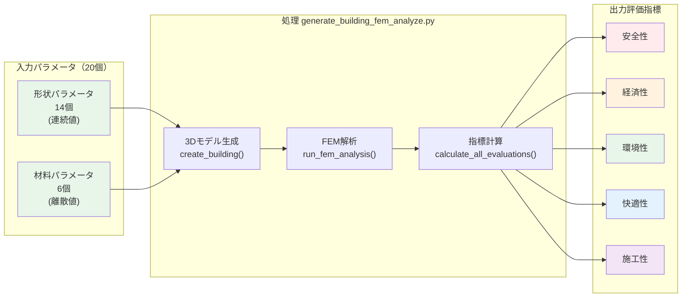
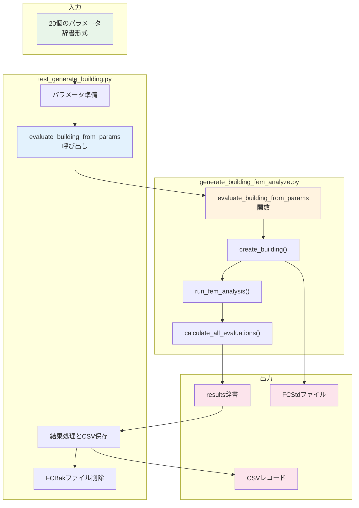
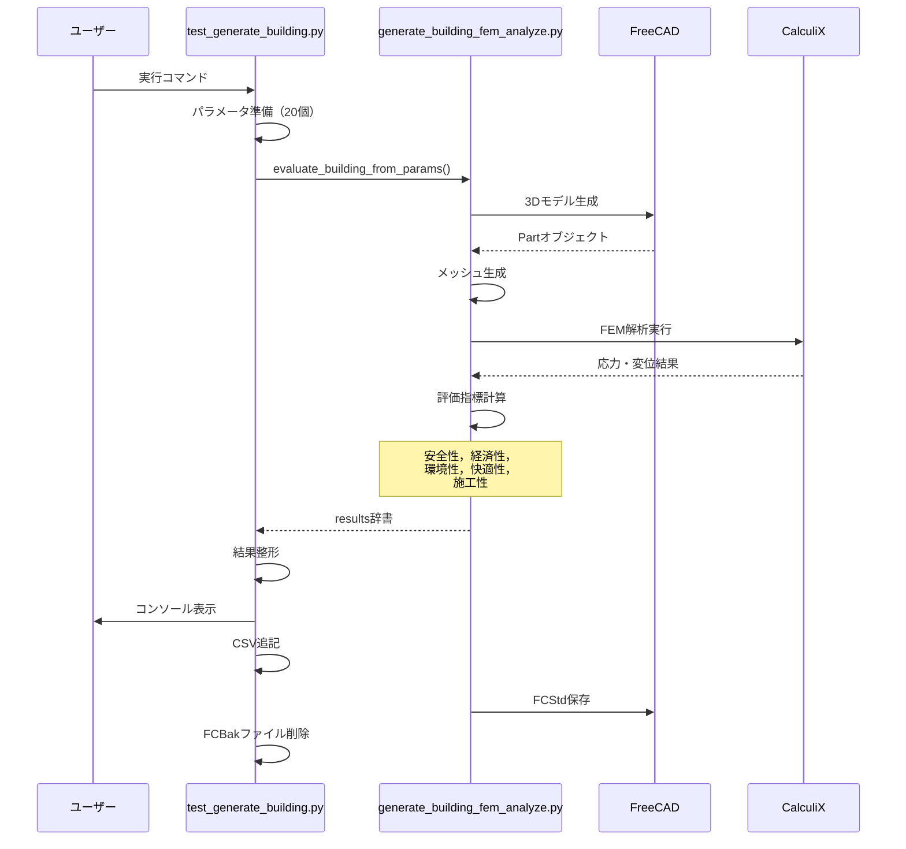

# `test_generate_building.py` 使用ガイド

## 概要
`test_generate_building.py`は，`generate_building_fem_analyze.py`の動作確認を目的としたテストスクリプトです．指定したパラメータで建物を生成し，FEM解析を実行して結果を表示・保存します．

## システム全体の流れ

### パラメータと評価指標の流れ



## 入力パラメータ（20個）の詳細

### 形状パラメータ（14個）- すべて連続値

#### 建物寸法（4個）

| パラメータ名 | 説明 | 型・範囲 | 単位 |
|-------------|------|---------|------|
| Lx | 建物幅 | 実数値 | m |
| Ly | 建物奥行 | 実数値 | m |
| H1 | 1階高さ | 実数値 | m |
| H2 | 2階高さ | 実数値 | m |

#### 構造部材（5個）

| パラメータ名 | 説明 | 型・範囲 | 単位 |
|-------------|------|---------|------|
| tf | 床スラブ厚 | 実数値 | mm |
| tr | 屋根スラブ厚 | 実数値 | mm |
| bc | 柱幅 | 実数値 | mm |
| hc | 柱高さ（断面） | 実数値 | mm |
| tw_ext | 外壁厚 | 実数値 | mm |

#### 設計特性（5個）

| パラメータ名 | 説明 | 型・範囲 | 単位 |
|-------------|------|---------|------|
| wall_tilt_angle | 壁傾斜角 | 実数値 | 度 |
| window_ratio_2f | 2階窓面積比 | 0.0～1.0 | - |
| roof_morph | 屋根形態（0:フラット，1:かまぼこ） | 0.0～1.0 | - |
| roof_shift | 屋根シフト | -1.0～1.0 | - |
| balcony_depth | バルコニー奥行 | 実数値 | m |

### 材料パラメータ（6個）- 離散値

| パラメータ名 | 値 | 説明 |
|-------------|-----|------|
| material_columns | 0 or 1 | 柱材料（0:コンクリート，1:木材） |
| material_floor1 | 0 or 1 | 1階床材料（0:コンクリート，1:木材） |
| material_floor2 | 0 or 1 | 2階床材料（0:コンクリート，1:木材） |
| material_roof | 0 or 1 | 屋根材料（0:コンクリート，1:木材） |
| material_walls | 0 or 1 | 外壁材料（0:コンクリート，1:木材） |
| material_balcony | 0 or 1 | バルコニー材料（0:コンクリート，1:木材） |


## 出力評価指標（5項目）の詳細

| 評価項目 | 説明 | 単位 | 良好な値 |
|---------|------|------|----------|
| **安全率** | FEM解析による構造安全性 | - | > 2.0 |
| **コスト** | 建設費用 | 円/m² | < 500,000 |
| **CO2排出量** | 環境負荷 | kg-CO2/m² | 低いほど良い |
| **快適性スコア** | 空間品質評価 | 0-10 | > 6.0 |
| **施工性スコア** | 施工難易度評価 | 0-10 | > 6.0 |

**⚠️ 重要な注意事項**：

- FEM解析（有限要素法）の内部処理では、メッシュ生成時に乱数を使用しています
- そのため、**同じパラメータでも実行するたびに安全率などの値がある程度変動します**
- 変動幅は通常±10〜20%程度ですが、複雑な形状では変動が大きくなることがあります


## 2つのスクリプトの関係性

### 役割分担

#### 🧪 `test_generate_building.py`（テストスクリプト）
- **役割**: コア解析エンジンのテストとデバッグ
- **責務**:
  - テスト用パラメータの準備
  - 解析エンジンの呼び出し（evaluate_building_from_params関数）
  - 結果の整形と表示
  - CSVファイルへの記録
  - FCBakファイルの自動削除（FreeCADの自動バックアップファイルをクリーンアップ）
- **特徴**: シンプルで単一パラメータセットの評価に特化

#### ⚙️ `generate_building_fem_analyze.py`（コア解析エンジン）
- **役割**: 建物生成とFEM解析の実行
- **責務**:
  - 3D建物モデルの生成
  - FEM解析の実行
  - 評価指標の計算
  - FCStdファイルの保存
- **特徴**: 再利用可能な関数（evaluate_building_from_params）として提供

### データの流れ



### 具体的な実装

```python
# test_generate_building.py の主要部分
from generate_building_fem_analyze import evaluate_building_from_params

# デフォルトのテスト用パラメータ
# ※推奨値は建物のデザインが崩れず、構造的に妥当な範囲を示しています
test_params = {
    # 建物寸法
    'Lx': 8.5,           # 建物幅 [m] (推奨値: [8.0, 12.0])
    'Ly': 9.0,           # 建物奥行 [m] (推奨値: [8.0, 12.0])
    'H1': 3.0,           # 1階高さ [m] (推奨値: [2.6, 3.5])
    'H2': 3.0,           # 2階高さ [m] (推奨値: [2.6, 3.5])
    
    # 構造部材寸法
    'tf': 400,           # 床スラブ厚 [mm] (推奨値: [350, 600])
    'tr': 450,           # 屋根スラブ厚 [mm] (推奨値: [350, 600])
    'bc': 450,           # 柱幅 [mm] (推奨値: [400, 1000])
    'hc': 450,           # 柱高さ [mm] (推奨値: [400, 1000])
    'tw_ext': 350,       # 外壁厚 [mm] (推奨値: [300, 500])
    
    # その他の設計パラメータ
    'wall_tilt_angle': -25,      # 壁傾斜角 [度] (推奨値: [-30.0, 30.0])
    'window_ratio_2f': 0.7,      # 2階窓面積比 (推奨値: [0.1, 0.9])
    'roof_morph': 0.9,           # 屋根形態 (推奨値: [0.0, 1.0])
    'roof_shift': 0.4,           # 屋根シフト (推奨値: [-0.5, 0.5])
    'balcony_depth': 1.8,        # バルコニー奥行 [m] (推奨値: [1.0, 3.5])
    
    # 材料パラメータ（0:コンクリート, 1:木材）
    'material_columns': 0,      # 柱材料
    'material_floor1': 0,       # 1階床材料
    'material_floor2': 0,       # 2階床材料
    'material_roof': 0,         # 屋根材料
    'material_walls': 1,        # 外壁材料
    'material_balcony': 0       # バルコニー材料
}

# コア解析エンジンを呼び出し
results = evaluate_building_from_params(
    test_params,
    save_fcstd=True,
    fcstd_path=fcstd_filename
)

# 結果をCSVに保存
save_to_csv(results)
```


### なぜ分離されているか

1. **モジュール性**: コア機能（generate_building_fem_analyze.py）を他のスクリプトからも利用可能
2. **テスト容易性**: テストロジックと本体ロジックの分離
3. **拡張性**: PSO.pyやrandom_building_sampler.pyなど，複数のスクリプトから同じエンジンを利用
4. **保守性**: 各ファイルが単一の責務を持つことで管理が容易

## 主な機能
- 単一サンプルの建物生成とFEM解析
- 結果の詳細表示（安全性，経済性，環境性，快適性，施工性）
- CSV形式での結果保存（タイムスタンプ付きまたは固定ファイル名）
- FCStdファイルの生成（タイムスタンプ付き）
- FCBakファイルの自動削除機能
- 実行時間の計測

## 実行方法

### Mac
```bash
/Applications/FreeCAD.app/Contents/Resources/bin/freecadcmd test_generate_building.py
```

### Windows
```bash
 & "C:\Program Files\FreeCAD 1.0\bin\freecadcmd.exe" test_generate_building.py
```


**注意**: 上記のパスはお使いのPCの環境に合わせて調整してください．FreeCADのインストール先が異なる場合は，適切なパスに変更する必要があります．

## パラメータ設定

### デフォルトパラメータ

```python
# 建物寸法
'Lx': 8.5,           # 建物幅 [m] (推奨値: 8.0-12.0)
'Ly': 9.0,           # 建物奥行 [m] (推奨値: 8.0-12.0)
'H1': 3.0,           # 1階高さ [m] (推奨値: 2.6-3.5)
'H2': 3.0,           # 2階高さ [m] (推奨値: 2.6-3.5)

# 構造部材寸法
'tf': 400,           # 床スラブ厚 [mm] (推奨値: 350-600)
'tr': 450,           # 屋根スラブ厚 [mm] (推奨値: 350-600)
'bc': 450,           # 柱幅 [mm] (推奨値: 400-1000)
'hc': 450,           # 柱高さ [mm] (推奨値: 400-1000)
'tw_ext': 350,       # 外壁厚 [mm] (推奨値: 300-500)

# その他の設計パラメータ
'wall_tilt_angle': -25,   # 壁傾斜角 [度] (推奨値: -30.0～30.0)
'window_ratio_2f': 0.7,   # 2階窓面積比 (推奨値: 0.1-0.9)
'roof_morph': 0.9,        # 屋根形態 (推奨値: 0.0-1.0)
'roof_shift': 0.4,        # 屋根シフト (推奨値: -0.5～0.5)
'balcony_depth': 1.8      # バルコニー奥行 [m] (推奨値: 1.0-3.5)
```

### 材料パラメータ

```python
# 0: コンクリート, 1: 木材
'material_columns': 0,    # 柱材料
'material_floor1': 0,     # 1階床材料
'material_floor2': 0,     # 2階床材料
'material_roof': 0,       # 屋根材料
'material_walls': 1,      # 外壁材料（木材）
'material_balcony': 0     # バルコニー材料
```

### パラメータの推奨範囲（デザインが崩れない範囲）

以下は`random_building_sampler.py`で使用されている範囲で、建物のデザインが崩れず、構造的にも妥当な値の範囲です：

| パラメータ | 推奨最小値 | 推奨最大値 | 単位 | 備考 |
|-----------|-----------|-----------|------|------|
| **建物寸法** |
| Lx | 8.0 | 12.0 | m | 建物幅 |
| Ly | 8.0 | 12.0 | m | 建物奥行 |
| H1 | 2.6 | 3.5 | m | 1階高さ（建築基準法準拠） |
| H2 | 2.6 | 3.5 | m | 2階高さ |
| **構造部材寸法** |
| tf | 350 | 600 | mm | 床スラブ厚（安全率確保） |
| tr | 350 | 600 | mm | 屋根スラブ厚 |
| bc | 400 | 1000 | mm | 柱幅（構造安定性） |
| hc | 400 | 1000 | mm | 柱高さ（断面） |
| tw_ext | 300 | 500 | mm | 外壁厚 |
| **設計パラメータ** |
| wall_tilt_angle | -30 | 30 | 度 | 壁傾斜角 |
| window_ratio_2f | 0.1 | 0.9 | - | 2階窓面積比 |
| roof_morph | 0.0 | 1.0 | - | 屋根形態（0:フラット、1:かまぼこ） |
| roof_shift | -0.5 | 0.5 | - | 屋根シフト |
| balcony_depth | 1.0 | 3.5 | m | バルコニー奥行 |

**注意**: 
- これらの範囲は構造的安定性とデザインの妥当性を考慮した推奨値です
- 学習目的でこれらの範囲外の値を試すことも可能ですが、極端な値では解析エラーや非現実的な結果になる可能性があります
- 特に構造部材寸法を推奨値より小さくすると、安全率が大幅に低下する可能性があります

## 出力ファイル

### 1. CSVファイル
- **ファイル名**: `test_results.csv`（固定）
- **動作**: 既存ファイルに追記（ファイルが無い場合は新規作成）
- **内容**: 
  - 入力パラメータ（20項目）
  - 評価結果（安全率，コスト，CO2，快適性，施工性）
  - 実行情報（タイムスタンプ，実行時間，ステータス）

### 2. FCStdファイル
- **ファイル名**: `test_building_YYYYMMDD_HHMMSS.FCStd`（タイムスタンプ付き）
- **設定**: `USE_TIMESTAMP_FOR_FCSTD = True`で制御可能
- **内容**: 生成された建物の3Dモデル（FreeCAD形式）
- **開き方**: 
  - FreeCADアプリケーションで直接開くことができます
  - ファイル → 開く → FCStdファイルを選択
  - または、FCStdファイルをダブルクリック（FreeCADがインストールされている場合）
- **FCStdファイルとは**: 
  - FreeCADの標準ファイル形式（FreeCAD Standard Document）
  - 3Dモデル、FEM解析設定、材料情報などすべてのデータを含む
  - 圧縮されたXML形式で、実際にはZIPアーカイブ
  - 他のCADソフトへのエクスポート（STEP、IGES、STL等）も可能

## 出力例
```
=== 建物評価テスト実行開始 ===

入力パラメータ:
  Lx: 8.5
  Ly: 9.0
  H1: 3.0
  H2: 3.0
  tf: 400
  tr: 450
  bc: 450
  hc: 450
  tw_ext: 350
  wall_tilt_angle: -25
  window_ratio_2f: 0.7
  roof_morph: 0.9
  roof_shift: 0.4
  balcony_depth: 1.8
  material_columns: 0 (コンクリート)
  material_floor1: 0 (コンクリート)
  material_floor2: 0 (コンクリート)
  material_roof: 0 (コンクリート)
  material_walls: 1 (木材)
  material_balcony: 0 (コンクリート)

解析実行中...

=== 解析結果 ===

【安全性】
  安全率: 1.079
  最大変位: 8.116 mm
  最大応力: 32.433 MPa

【経済性】
  建設コスト: 618,276 円/㎡
  総工費: 47,298,095 円

【環境性】
  CO2排出量: 1571.2 kg-CO2/㎡
  最適化ポテンシャル: 25.0%

【快適性】
  快適性スコア: 5.86/10
    空間の広がり: 0.50
    採光・眺望: 7.45
    開放感: -1.50
    プライバシー: 4.00

【施工性】
  施工性スコア: 4.25/10

✅ 結果をCSVファイルに保存しました: test_results.csv
🗑️ 生成された.FCBakファイルを削除中...
   削除: test_building_20250810_132410.FCBak
✅ 1個の.FCBakファイルを削除しました

=== テスト完了 ===
```


### テスト実行方法

#### Mac
```bash
/Applications/FreeCAD.app/Contents/Resources/bin/freecadcmd test_generate_building.py
```

#### Windows
```bash
 & "C:\Program Files\FreeCAD 1.0\bin\freecadcmd.exe" test_generate_building.py
```


**注意**: 上記のパスはお使いのPCの環境に合わせて調整してください．

### 出力データ
`test_results.csv`には以下の情報が記録されます（ファイルが存在しない場合は自動作成，既存の場合は追記）：

• **設計パラメータ（20個）**

| カテゴリ | 内容 |
|---------|------|
| 基本形状 | 建物幅，奥行，各階高さ |
| 構造寸法 | 床・屋根スラブ厚，柱サイズ，壁厚 |
| 追加要素 | 壁傾斜角，窓面積比，屋根形状，バルコニー奥行 |
| 材料選択 | 各部位の材料（0:コンクリート，1:木材） |

• **評価指標（5項目）**

| 評価項目 | 説明 | 単位 |
|---------|------|------|
| 安全率 | FEM解析による構造安全性 | - |
| コスト | 建設費用 | 円/m² |
| CO2排出量 | 環境負荷 | kg-CO2/m² |
| 快適性スコア | 空間品質評価 | 0-10 |
| 施工性スコア | 施工難易度評価 | 0-10 |

• **実行メタデータ**

  - タイムスタンプ: 実行日時
  - 処理時間: 評価に要した時間 [秒]
  - FCStdファイルパス: 生成された3Dモデルファイル

---

## システム構成と関係図

### データフローの詳細



## 注意事項
1. FreeCADのコマンドライン版（freecadcmd）で実行する必要があります
2. `generate_building_fem_analyze.py`が同じディレクトリに存在する必要があります
3. CalculiXがインストールされている必要があります（FEM解析用）
4. 実行時間は通常2〜5秒程度ですが，複雑な形状では長くなることがあります
5. FCBakファイルは実行ごとに自動的に削除されます（ディスク容量の節約）

## トラブルシューティング

### ModuleNotFoundError
親ディレクトリにFem.pyなどの競合するファイルがある場合，モジュールの読み込みエラーが発生することがあります．このスクリプトは現在のディレクトリのみをPythonパスに追加するよう設計されています．

### FEM解析エラー
メッシュ生成やソルバー実行でエラーが発生した場合，VERBOSE_OUTPUTを有効にして詳細なエラー情報を確認してください．

### CSV出力エラー
ファイルが他のプログラムで開かれている場合，書き込みエラーが発生します．CSVファイルを閉じてから再実行してください．

