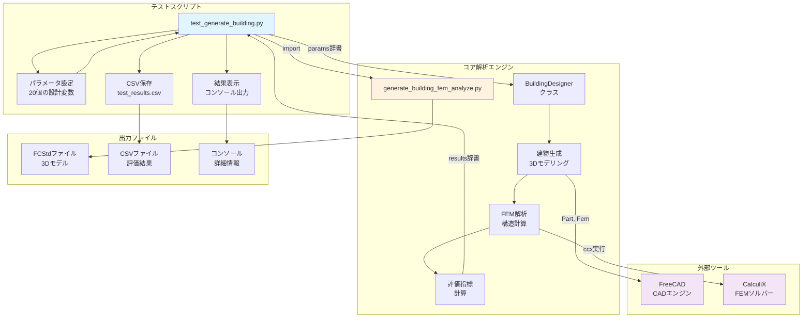
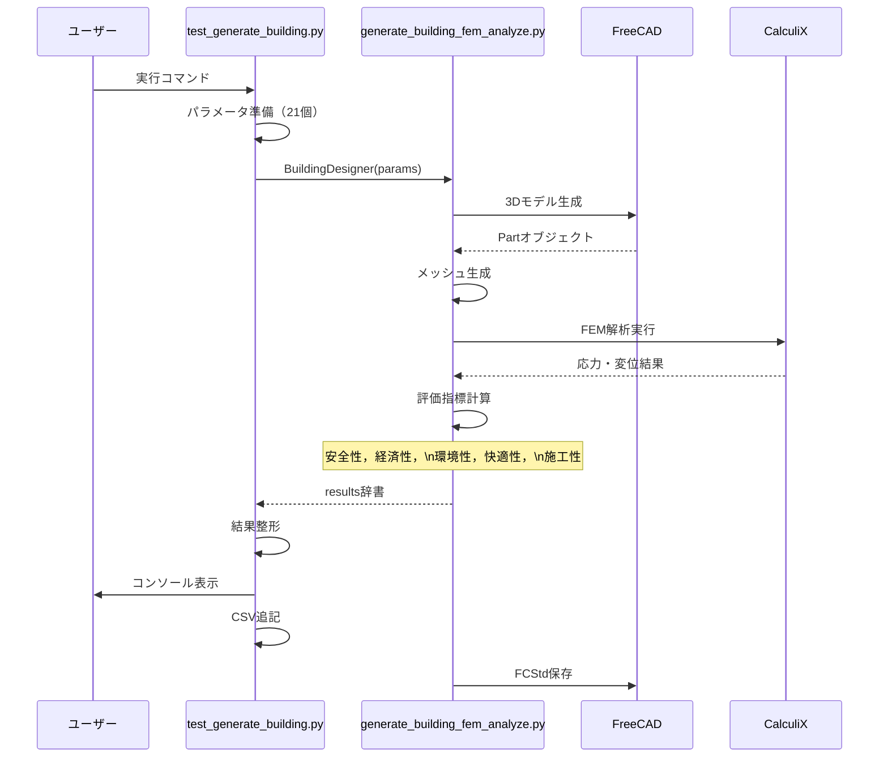
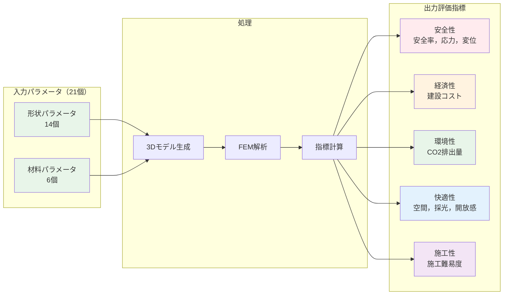

# `test_generate_building.py` 使用ガイド

## 概要
`test_generate_building.py`は，`generate_building_fem_analyze.py`の動作確認を目的としたテストスクリプトです．指定したパラメータで建物を生成し，FEM解析を実行して結果を表示・保存します．

## 2つのスクリプトの関係性

### 役割分担

#### 🧪 `test_generate_building.py`（テストスクリプト）
- **役割**: コア解析エンジンのテストとデバッグ
- **責務**:
  - テスト用パラメータの準備
  - 解析エンジンの呼び出し
  - 結果の整形と表示
  - CSVファイルへの記録
- **特徴**: シンプルで単一パラメータセットの評価に特化

#### ⚙️ `generate_building_fem_analyze.py`（コア解析エンジン）
- **役割**: 建物生成とFEM解析の実行
- **責務**:
  - 3D建物モデルの生成
  - FEM解析の実行
  - 評価指標の計算
  - FCStdファイルの保存
- **特徴**: 再利用可能なクラス（BuildingDesigner）として実装

### データの流れ

```mermaid
graph LR
    subgraph "入力"
        P[20個のパラメータ\n辞書形式]
    end
    
    subgraph "test_generate_building.py"
        T1[パラメータ準備]
        T2[BuildingDesigner呼び出し]
        T3[結果処理]
    end
    
    subgraph "generate_building_fem_analyze.py"
        G1[BuildingDesignerクラス]
        G2[create_building()]
        G3[run_fem_analysis()]
        G4[calculate_all_evaluations()]
    end
    
    subgraph "出力"
        O1[results辞書]
        O2[FCStdファイル]
        O3[CSVレコード]
    end
    
    P --> T1
    T1 --> T2
    T2 --> G1
    G1 --> G2
    G2 --> G3
    G3 --> G4
    G4 --> O1
    O1 --> T3
    T3 --> O3
    G2 --> O2
    
    style T2 fill:#e3f2fd
    style G1 fill:#fff3e0
```

### 具体的な実装

```python
# test_generate_building.py の主要部分
from generate_building_fem_analyze import BuildingDesigner

# パラメータ設定
params = {
    'Lx': 8.0, 'Ly': 6.0, 'H1': 3.0, 'H2': 3.0,
    'tf': 200, 'tr': 150, 'bc': 300, 'hc': 300,
    # ... 他のパラメータ
}

# コア解析エンジンを呼び出し
designer = BuildingDesigner(params)
results = designer.evaluate()  # 3Dモデル生成→FEM解析→評価

# 結果をCSVに保存
save_to_csv(results)
```

### なぜ分離されているか

1. **モジュール性**: コア機能（generate_building_fem_analyze.py）を他のスクリプトからも利用可能
2. **テスト容易性**: テストロジックと本体ロジックの分離
3. **拡張性**: PSO.pyやrandom_building_sampler.pyなど，複数のスクリプトから同じエンジンを利用
4. **保守性**: 各ファイルが単一の責務を持つことで管理が容易

### テストコード
- **`test_generate_building.py`**  基本的な動作確認用テストスクリプト
  - 様々なパラメータでの建物生成と評価をテスト
  - 結果をtest_results.csvに保存
  - FreeCADのCUIモード（freecadcmd）で実行

### テスト実行方法

#### Mac
```bash
/Applications/FreeCAD.app/Contents/Resources/bin/freecadcmd test_generate_building.py
```

#### Windows
```bash
 & "C:\Program Files\FreeCAD 1.0\bin\freecadcmd.exe" test_generate_building.py
```


**注意**: 上記のパスはお使いのPCの環境に合わせて調整してください．

### 出力データ
`test_results.csv`には以下の情報が記録されます（ファイルが存在しない場合は自動作成，既存の場合は追記）：

• **設計パラメータ（20個）**

| カテゴリ | 内容 |
|---------|------|
| 基本形状 | 建物幅，奥行，各階高さ |
| 構造寸法 | 床・屋根スラブ厚，柱サイズ，壁厚 |
| 追加要素 | 壁傾斜角，窓面積比，屋根形状，バルコニー奥行 |
| 材料選択 | 各部位の材料（0:コンクリート，1:木材） |

• **評価指標（5項目）**

| 評価項目 | 説明 | 単位 |
|---------|------|------|
| 安全率 | FEM解析による構造安全性 | - |
| コスト | 建設費用 | 円/m² |
| CO2排出量 | 環境負荷 | kg-CO2/m² |
| 快適性スコア | 空間品質評価 | 0-10 |
| 施工性スコア | 施工難易度評価 | 0-10 |

• **実行メタデータ**

  - タイムスタンプ: 実行日時
  - 処理時間: 評価に要した時間 [秒]
  - FCStdファイルパス: 生成された3Dモデルファイル


---


## システム構成と関係図

### モジュール間の関係



### データフローの詳細



### パラメータと評価指標の流れ



## 主な機能
- 単一サンプルの建物生成とFEM解析
- 結果の詳細表示（安全性，経済性，環境性，快適性，施工性）
- CSV形式での結果保存
- FCStdファイルの生成
- 実行時間の計測

## 実行方法

### Mac
```bash
/Applications/FreeCAD.app/Contents/Resources/bin/freecadcmd test_generate_building.py
```

### Windows
```bash
 & "C:\Program Files\FreeCAD 1.0\bin\freecadcmd.exe" test_generate_building.py
```


**注意**: 上記のパスはお使いのPCの環境に合わせて調整してください．FreeCADのインストール先が異なる場合は，適切なパスに変更する必要があります．

## パラメータ設定

### デフォルトパラメータ
```python
# 建物寸法
'Lx': 8.0,           # 建物幅 [m]
'Ly': 6.0,           # 建物奥行 [m]
'H1': 3.0,           # 1階高さ [m]
'H2': 3.0,           # 2階高さ [m]

# 構造部材寸法
'tf': 200,           # 床スラブ厚 [mm]
'tr': 150,           # 屋根スラブ厚 [mm]
'bc': 300,           # 柱幅 [mm]
'hc': 300,           # 柱高さ [mm]
'tw_ext': 150,       # 外壁厚 [mm]

# その他の設計パラメータ
'wall_tilt_angle': -25,   # 壁傾斜角 [度]
'window_ratio_2f': 0.7,   # 2階窓面積比 (0.0-0.8)
'roof_morph': 0.9,        # 屋根形態 (0.0-1.0)
'roof_shift': 0.7,        # 屋根シフト (-1.0-1.0)
'balcony_depth': 1.8      # バルコニー奥行 [m]
```

### 材料パラメータ
```python
# 0: コンクリート, 1: 木材
'material_columns': 0,    # 柱材料
'material_floor1': 0,     # 1階床材料
'material_floor2': 0,     # 2階床材料
'material_roof': 0,       # 屋根材料
'material_walls': 1,      # 外壁材料（木材）
'material_balcony': 0     # バルコニー材料
```

## 出力ファイル

### 1. CSVファイル
- **ファイル名**: `test_results.csv`（固定）
- **動作**: 既存ファイルに追記（ファイルが無い場合は新規作成）
- **内容**: 
  - 入力パラメータ（20項目）
  - 評価結果（安全率，コスト，CO2，快適性，施工性）
  - 実行情報（タイムスタンプ，実行時間，ステータス）

### 2. FCStdファイル
- **ファイル名**: `test_building_YYYYMMDD_HHMMSS.FCStd`
- **内容**: 生成された建物の3Dモデル（FreeCAD形式）

## 出力例
```
=== 建物評価テスト実行開始 ===

入力パラメータ:
  Lx: 8.0
  Ly: 6.0
  H1: 3.0
  H2: 3.0
  tf: 200
  tr: 150
  bc: 300
  hc: 300
  tw_ext: 150
  wall_tilt_angle: -25
  window_ratio_2f: 0.7
  roof_morph: 0.9
  roof_shift: 0.7
  balcony_depth: 1.8
  material_columns: 0 (コンクリート)
  material_floor1: 0 (コンクリート)
  material_floor2: 0 (コンクリート)
  material_roof: 0 (コンクリート)
  material_walls: 1 (木材)
  material_balcony: 0 (コンクリート)

解析実行中...

=== 解析結果 ===

【安全性】
  安全率: 0.550
  最大変位: 26.373 mm
  最大応力: 24.730 MPa

【経済性】
  建設コスト: 425,565 円/㎡
  総工費: 20,427,130 円

【環境性】
  CO2排出量: 1317.5 kg-CO2/㎡
  最適化ポテンシャル: 0.0%

【快適性】
  快適性スコア: 5.45/10
    空間の広がり: 2.88
    採光・眺望: 6.00
    開放感: 9.00
    プライバシー: 3.00

【施工性】
  施工性スコア: 4.25/10

実行時間: 4.2秒
```

## カスタマイズ

### パラメータの変更
`default_params`や`material_params`の値を編集することで，異なる設計条件でテストできます．

### ファイル名設定
```python
USE_TIMESTAMP = False  # True: タイムスタンプ付き, False: 固定ファイル名
USE_TIMESTAMP_FOR_FCSTD = True  # FCStdファイルにタイムスタンプを付ける
```

### デバッグ出力
```python
os.environ['VERBOSE_OUTPUT'] = 'True'  # 詳細なデバッグ情報を表示
```

## 注意事項
1. FreeCADのコマンドライン版（freecadcmd）で実行する必要があります
2. `generate_building_fem_analyze.py`が同じディレクトリに存在する必要があります
3. CalculiXがインストールされている必要があります（FEM解析用）
4. 実行時間は通常2〜5秒程度ですが，複雑な形状では長くなることがあります

## トラブルシューティング

### ModuleNotFoundError
親ディレクトリにFem.pyなどの競合するファイルがある場合，モジュールの読み込みエラーが発生することがあります．このスクリプトは現在のディレクトリのみをPythonパスに追加するよう設計されています．

### FEM解析エラー
メッシュ生成やソルバー実行でエラーが発生した場合，VERBOSE_OUTPUTを有効にして詳細なエラー情報を確認してください．

### CSV出力エラー
ファイルが他のプログラムで開かれている場合，書き込みエラーが発生します．CSVファイルを閉じてから再実行してください．

## 想定される実験作業（初学者向け）

### はじめに：Pythonの基本
実験を始める前に，以下のPythonの基本を理解しておきましょう：

```python
# 変数の定義
building_width = 10.0  # 建物の幅を10メートルに設定

# 辞書（dictionary）の使い方
params = {
    'Lx': 10.0,    # キー'Lx'に値10.0を対応させる
    'Ly': 8.0      # キー'Ly'に値8.0を対応させる
}

# 辞書の値にアクセス
print(params['Lx'])  # 10.0が表示される

# ループ（繰り返し）
for i in range(5):   # 0から4まで5回繰り返す
    print(i)
```

### 1. 最初の実験：単一パラメータの変更
**目的**: 建物の幅（Lx）を変えると，コストや安全率がどう変わるか調べる

**ステップ1**: test_generate_building.pyを理解する

```python
# test_generate_building.pyの該当部分を確認
default_params = {
    'Lx': 8.0,           # ← この値を変更して実験します
    'Ly': 6.0,
    # ... 他のパラメータ
}
```

**ステップ2**: 手動で値を変更して実験
1. テキストエディタでtest_generate_building.pyを開く
2. `'Lx': 8.0,`の行を見つける
3. 値を変更（例：`'Lx': 9.0,`）
4. ファイルを保存
5. ターミナルで実行：
   - **Mac**: `/Applications/FreeCAD.app/Contents/Resources/bin/freecadcmd test_generate_building.py`
   - **Windows**: `"C:\Program Files\FreeCAD 0.21\bin\FreeCADCmd.exe" test_generate_building.py`
   - **Linux**: `freecadcmd test_generate_building.py`
   - **注意**: パスは環境に合わせて調整してください
6. 結果をメモする
7. 他の値（10.0, 11.0, 12.0）でも繰り返す

**ステップ3**: 結果を整理する
```python
# 結果を手動で記録（例）
results = [
    {'Lx': 8.0,  'cost': 180000, 'safety': 1.8},
    {'Lx': 9.0,  'cost': 185000, 'safety': 1.9},
    {'Lx': 10.0, 'cost': 190000, 'safety': 2.0},
    {'Lx': 11.0, 'cost': 195000, 'safety': 2.1},
    {'Lx': 12.0, 'cost': 200000, 'safety': 2.2},
]

# 結果を表示
for r in results:
    print(f"幅{r['Lx']}m: コスト{r['cost']}円, 安全率{r['safety']}")
```

### 2. CSVファイルの活用方法
**目的**: 実験結果を自動的に記録し，後で分析する

**ステップ1**: CSVファイルを理解する

```python
# CSVファイルは表形式のデータを保存するファイルです
# test_results.csvの中身の例：
# タイムスタンプ,Lx,Ly,cost_per_sqm,safety_factor
# 2025-01-24 10:00:00,8.0,6.0,180000,1.8
# 2025-01-24 10:05:00,9.0,6.0,185000,1.9
```

**ステップ2**: CSVファイルを読み込んで分析

```python
# CSVファイルを読み込むプログラム（analyze_results.py）
import pandas as pd  # データ分析用のライブラリ

# CSVファイルを読み込む
df = pd.read_csv('test_results.csv', encoding='utf-8-sig')

# データの最初の5行を表示
print("データの最初の5行:")
print(df.head())

# 平均値を計算
print("\n平均値:")
print(f"平均コスト: {df['cost_per_sqm'].mean():.0f}円")
print(f"平均安全率: {df['safety_factor'].mean():.2f}")

# 安全率2.0以上のデータだけを抽出
safe_buildings = df[df['safety_factor'] >= 2.0]
print(f"\n安全率2.0以上の建物: {len(safe_buildings)}件")
```

### 3. 材料の違いを調べる実験
**目的**: コンクリート（0）と木材（1）でどう変わるか調べる

**ステップ1**: 材料の意味を理解する

```python
# 材料の数字の意味
# 0 = コンクリート（重くて強い，高価）
# 1 = 木材（軽くて柔らかい，安価）

material_params = {
    'material_columns': 0,      # 柱：コンクリート
    'material_floor1': 0,       # 1階床：コンクリート
    'material_floor2': 0,       # 2階床：コンクリート
    'material_roof': 0,         # 屋根：コンクリート
    'material_walls': 1,        # 外壁：木材
    'material_balcony': 0       # バルコニー：コンクリート
}
```

**ステップ2**: 材料を変更して実験
1. test_generate_building.pyを開く
2. material_paramsセクションを見つける
3. 全てコンクリート（0）に変更して実行
4. 全て木材（1）に変更して実行
5. 結果を比較

```python
# 結果の比較（手動記録の例）
print("=== 材料による違い ===")
print("全コンクリート: コスト250,000円, CO2=1,500kg")
print("全木材:         コスト150,000円, CO2=500kg")
print("→ 木材の方が環境に優しく，安価")
```


### 7. よくある質問と解決方法

**Q1: エラーが出て実行できません**

```python
# エラーメッセージを読んで原因を特定
# 例：IndentationError → インデント（字下げ）が間違っている
# 例：NameError → 変数名のスペルミス
# 例：SyntaxError → カンマや括弧が足りない
```


