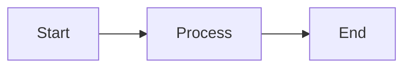
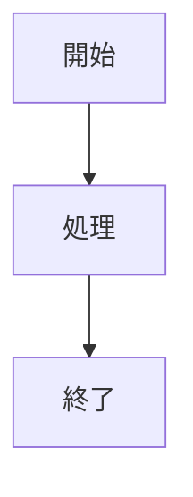
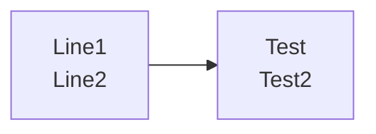
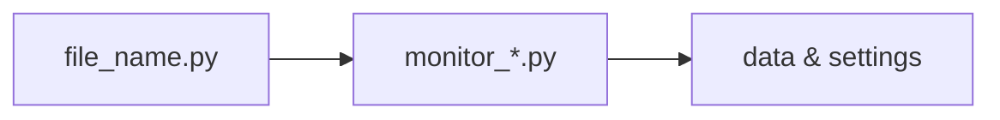

# Mermaidテスト

## 基本的なグラフ

```mermaid
graph LR
    A[Start] --> B[Process]
    B --> C[End]
```

## 日本語を含むグラフ

```mermaid
graph TD
    A[開始] --> B[処理]
    B --> C[終了]
```

## HTMLタグを含むグラフ

```mermaid
graph LR
    A["Line1\nLine2"] --> B["Test\nTest2"]
```

## 特殊文字を含むグラフ

```mermaid
graph LR
    A[file_name.py] --> B[monitor_*.py]
    B --> C[data & settings]
```